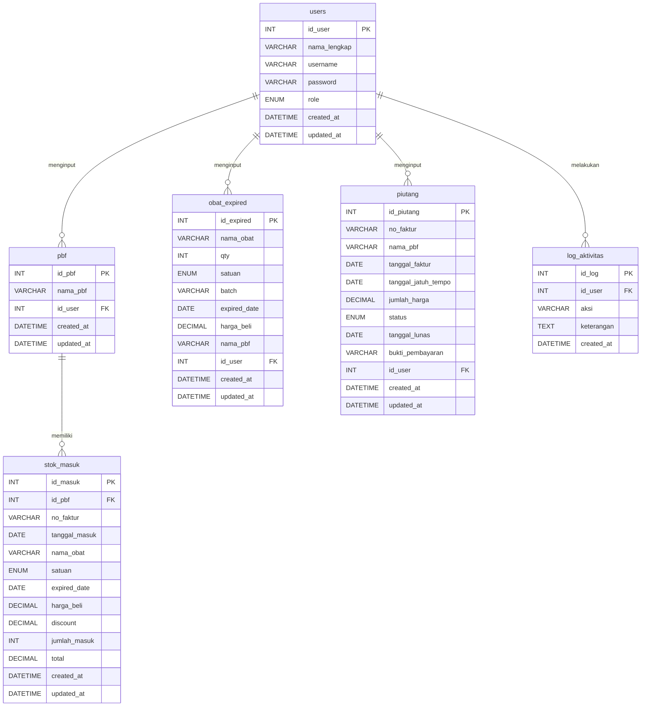
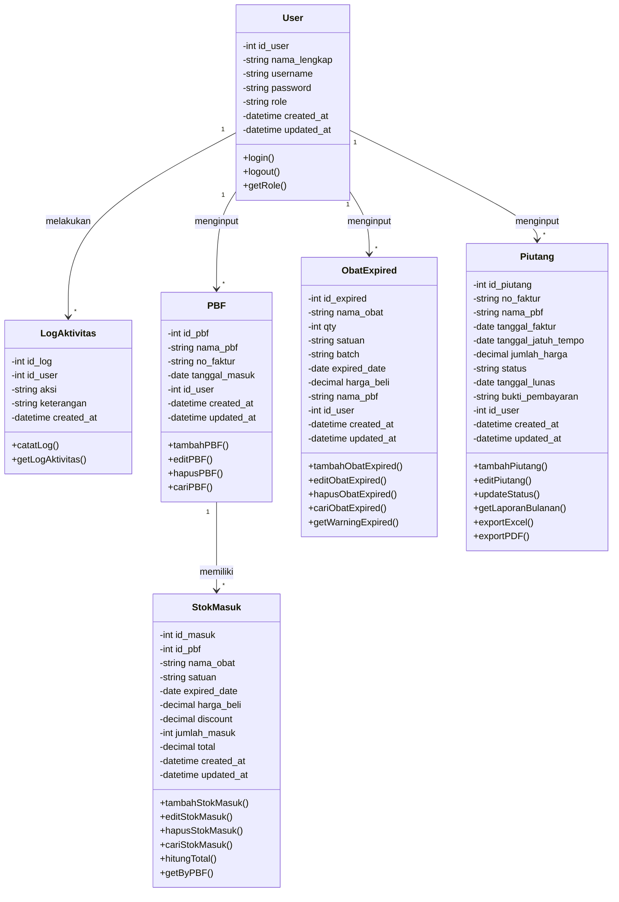

# PRODUCT REQUIREMENT DOCUMENT (PRD)

## Sistem Informasi Manajemen Stok Obat
## Apotek Ananda Jadimulya

**Versi:** 2.7 (Revisi)
**Tanggal:** 18 April 2026
**Disusun oleh:** Tim Pengembang

---

## Riwayat Perubahan

| Versi | Tanggal | Perubahan |
|-------|---------|-----------|
| 1.0 | - | Versi awal PRD |
| 2.0 | 4 April 2026 | Hapus fitur Kasir, Stok Keluar, Laporan Harian. Gabung Manajemen Obat ke Stok Masuk. Tambah fitur Piutang. |
| 2.1 | 4 April 2026 | Revisi struktur Stok Masuk jadi tabel per PBF (tambah kolom discount). Laporan Expired jadi input manual terpisah. Restructure database. |
| 2.2 | 4 April 2026 | Tambah tabel PBF sebagai header. Laporan Expired hanya Super Admin. Tambah fitur Global Search & navigasi per PBF. |
| 2.3 | 13 April 2026 | Mengubah istilah "Tambah Faktur" menjadi "Tambah PBF". Menambah kolom Upload Foto Bukti Pembayaran pada Piutang. |
| 2.4 | 13 April 2026 | Revisi total tampilan Stok Masuk: tampilan utama menampilkan seluruh obat secara global dengan filter tab per PBF. Tambah obat dilakukan secara global dengan memilih asal PBF. Klik obat menampilkan detail. |
| 2.5 | 17 April 2026 | Tambah kolom Expired Date di form dan tabel Stok Masuk. Laporan Obat Expired ditambah laporan otomatis (<= 6 bulan) dari stok masuk selain input manual. Update dashboard. |
| 2.6 | 17 April 2026 | Tambah fitur Log Aktivitas Akun untuk merekam riwayat aktivitas user (Super Admin & Admin). |
| 2.7 | 18 April 2026 | Update isi Dashboard untuk Super Admin & Admin. Membatasi hak akses Admin hanya untuk Manajemen Stok, PBF, dan Log Aktivitas. Memperjelas Integrasi fitur Tambah PBF berada tepat di dalam UI Manajemen Stok. |
| 2.8 | 18 April 2026 | Memindahkan kolom `no_faktur` dan `tanggal_masuk` dari tabel/form PBF ke tabel/form Stok Masuk karena bersifat transaksional per pesanan. |
| 2.9 | 18 April 2026 | Menambahkan rincian daftar aksi spesifik yang akan dicatat dan masuk ke fitur Log Aktivitas Akun pada bagian 4.9. |

---

## 1. Tujuan Aplikasi

Sistem Informasi Manajemen Stok Obat ini dikembangkan untuk membantu **Apotek Ananda Jadimulya** dalam mengelola persediaan obat secara lebih efektif dan efisien. Sistem ini bertujuan untuk menggantikan proses pencatatan manual menjadi sistem terkomputerisasi sehingga pengelolaan stok obat dapat dilakukan dengan lebih cepat, akurat, dan terstruktur.

Adapun tujuan dari pengembangan sistem ini adalah sebagai berikut:

1. Mempermudah pencatatan stok obat yang masuk dari PBF (Pedagang Besar Farmasi) per faktur.
2. Mempermudah pengelolaan dan pencarian data obat masuk di apotek.
3. Mempermudah pemantauan obat yang mendekati tanggal kedaluwarsa (expired date) baik secara otomatis dari stok masuk pengingat 6 bulan) maupun melalui input manual.
4. Mempermudah pencatatan dan pemantauan piutang ke PBF.
5. Mempermudah pembuatan laporan piutang secara otomatis dengan fitur export.
6. Meningkatkan efisiensi pengelolaan persediaan obat di Apotek Ananda Jadimulya.
7. Meningkatkan keamanan sistem melalui pencatatan riwayat (log) aktivitas seluruh pengguna.

---

## 2. Target User

Sistem ini merupakan **website internal apotek** yang hanya dapat digunakan oleh pengguna internal.

Terdapat dua jenis pengguna dalam sistem ini:

### 2.1 Super Admin (Apoteker)

Super Admin memiliki **akses penuh** terhadap seluruh fitur sistem.

**Hak akses Super Admin:**

| No | Hak Akses | Keterangan |
|----|-----------|------------|
| 1 | Mengakses Dashboard | Melihat ringkasan data apotek |
| 2 | Mengelola PBF & Stok Masuk | Tambah PBF, input obat global (pilih asal PBF), edit, hapus obat |
| 3 | Pencarian Obat | Mencari data obat dari seluruh PBF |
| 4 | Mengelola Laporan Obat Expired | Input, edit, hapus, dan lihat data obat expired |
| 5 | Mengelola Piutang | Input, edit, lihat, dan export data piutang |
| 6 | Mengelola Akun Admin | Tambah, edit, dan hapus akun admin |
| 7 | Mengakses Log Aktivitas | Melihat riwayat aktivitas seluruh akun |

---

### 2.2 Admin (Asisten Apoteker)

Admin bertugas membantu operasional apotek sehari-hari.

**Hak akses Admin:**

| No | Hak Akses | Keterangan |
|----|-----------|------------|
| 1 | Dashboard | Melihat ringkasan data apotek (Jumlah Stok & Log Aktivitas) |
| 2 | Manajemen Stok Obat | Mengelola input dan edit stok obat secara global (termasuk fitur pencarian obat dan tambah PBF yang terintegrasi di dalamnya) |
| 3 | Log Aktivitas | Melihat riwayat aktivitas |

> [!NOTE]
> Admin **SECARA EKSKLUSIF hanya memiliki akses** terhadap 3 menu/fitur di atas. Admin **tidak memiliki akses sama sekali** ke menu Laporan Obat Expired, Piutang, maupun Kelola Akun. Segala hal di luar Dashboard, Manajemen Stok, dan Log Aktivitas disembunyikan untuk Admin.

---

## 3. Alur Kerja Sistem

### 3.1 Input Stok Obat Masuk (Global dengan Filter PBF)

Proses ini dilakukan ketika PBF mengirim obat ke apotek. Halaman Stok Masuk menampilkan **seluruh data obat dari semua PBF** secara global. User dapat memfilter berdasarkan PBF tertentu menggunakan tombol/tab filter di bagian atas. Saat menambah obat baru, user memilih asal PBF langsung di dalam form input.

**Alur proses:**

```
Start
  │
  ▼
Admin/Super Admin login ke sistem
  │
  ▼
Membuka menu "Stok Masuk"
  │
  ▼
Sistem menampilkan SELURUH obat
dari SEMUA PBF dalam satu tabel global
  │
  ▼
┌──────────────────────────────────────────┐
│  [Semua] [Carmella] [Kimia Farma] [...]  │  ← Tab filter PBF
│──────────────────────────────────────────│
│  🔍 Cari obat...          [+ Tambah Obat]│
│──────────────────────────────────────────│
│  No │ Nama Obat │ PBF │ Satuan │ ...    │
│   1 │ Paracetamol│Carmella│ Strip │ ...   │
│   2 │ Amoxicillin│Carmella│ Box   │ ...   │
│   3 │ Omeprazole │KimiaF  │ Strip │ ...   │
│  ...│ ...       │ ...   │ ...   │ ...    │
└──────────────────────────────────────────┘
  │
  ▼
User bisa:
  (A) Filter per PBF → klik tab PBF tertentu
  (B) Cari obat → ketik di search bar
  (C) Tambah obat → klik "+ Tambah Obat"
  (D) Klik baris obat → lihat detail obat
  │
  ▼
┌──── Jika Tambah Obat (C) ────┐
│                               │
│  Klik "+ Tambah Obat"         │
│  │                            │
│  ▼                            │
│  Isi data obat:               │
│  - Asal PBF (pilih dari       │
│    daftar PBF yang ada, atau  │
│    klik "+ Tambah PBF Baru") │
│  - Nama obat                  │
│  - Satuan                     │
│  - Expired date               │
│  - Harga beli                 │
│  - Discount                   │
│  - Jumlah masuk               │
│  │                            │
│  ▼                            │
│  Sistem menghitung total:     │
│  Total = (Harga Beli -        │
│   Discount) × Jumlah Masuk    │
│  │                            │
│  ▼                            │
│  Klik Simpan                  │
│  │                            │
│  ▼                            │
│  Data obat masuk ke PBF       │
│  yang dipilih dan tampil      │
│  di tabel global              │
└───────────────────────────────┘
  │
  ▼
┌──── Jika Klik Detail Obat (D) ┐
│                                │
│  Klik baris obat di tabel      │
│  │                             │
│  ▼                             │
│  Sistem menampilkan popup/     │
│  halaman detail obat:          │
│  - Nama obat                   │
│  - Asal PBF                    │
│  - No. Faktur                  │
│  - Tanggal masuk               │
│  - Satuan                      │
│  - Expired date                │
│  - Harga beli                  │
│  - Discount                    │
│  - Jumlah masuk                │
│  - Total                       │
│  - Tombol Edit / Hapus         │
└────────────────────────────────┘
  │
  ▼
End
```

---

### 3.2 Pencarian Obat (Global Search)

Fitur pencarian terintegrasi di halaman Stok Masuk. User cukup mengetik nama obat di search bar, dan sistem akan menampilkan hasil dari **seluruh PBF**.

**Alur proses:**

```
Start
  │
  ▼
Login ke sistem
  │
  ▼
Buka menu "Stok Masuk"
  │
  ▼
Ketik nama obat di kolom search
(contoh: "Paracetamol")
  │
  ▼
Sistem memfilter tabel dan menampilkan
semua data obat "Paracetamol" dari
seluruh PBF (lengkap dengan kolom:
tanggal, satuan, harga beli, discount,
jumlah, total, no. faktur, nama PBF)
  │
  ▼
User dapat melihat perbandingan
harga dari berbagai PBF
  │
  ▼
Klik obat untuk melihat detail
  │
  ▼
End
```

---

### 3.3 Laporan Obat Expired (Otomatis & Manual)

Fitur ini akan secara otomatis menampilkan daftar obat dari **Stok Masuk** yang akan kedaluwarsa dalam **6 bulan ke depan** atau sudah lewat tanggal kedaluwarsa. 

Selain laporan otomatis, disediakan juga fitur **Input Data Manual** bagi **Super Admin** untuk mencatat obat expired di luar stok masuk (misal stok lama). Admin hanya dapat melihat data.

**Alur proses:**

```
Start
  │
  ▼
Login ke sistem
  │
  ▼
Membuka menu "Laporan Obat Expired"
  │
  ▼
Klik "Tambah Data Expired"
  │
  ▼
Isi data obat expired:
- Nama obat
- Qty (jumlah)
- Satuan
- Batch
- Expired date
- Harga beli
- Nama PBF
  │
  ▼
Klik Simpan
  │
  ▼
Sistem menyimpan data
  │
  ▼
Data ditampilkan di tabel laporan obat expired
  │
  ▼
End
```

---

### 3.4 Manajemen Piutang

Fitur ini digunakan untuk mencatat, memantau, dan merekap piutang apotek kepada PBF berdasarkan faktur pembelian.

**Alur proses input piutang:**

```
Start
  │
  ▼
Login ke sistem
  │
  ▼
Membuka menu "Piutang"
  │
  ▼
Klik "Tambah Piutang"
  │
  ▼
Isi data piutang:
- No. Faktur
- Nama PBF
- Tanggal Jatuh Tempo
- Jumlah Harga
- Status (Belum Lunas)
  │
  ▼
Sistem menyimpan data piutang
  │
  ▼
End
```

**Alur proses pelunasan piutang:**

```
Start
  │
  ▼
Login ke sistem
  │
  ▼
Membuka menu "Piutang"
  │
  ▼
Cari piutang yang akan dilunasi
  │
  ▼
Ubah status menjadi "Lunas" dan Upload foto bukti pembayaran
  │
  ▼
Sistem menyimpan foto bukti dan otomatis mencatat tanggal pelunasan
  │
  ▼
End
```

**Alur proses export laporan piutang:**

```
Start
  │
  ▼
Login ke sistem
  │
  ▼
Membuka menu "Piutang"
  │
  ▼
Pilih filter bulan/periode
  │
  ▼
Sistem menampilkan rekap piutang per bulan
  │
  ▼
Klik "Export" (format Excel/PDF)
  │
  ▼
File laporan terunduh
  │
  ▼
End
```

---

## 4. Feature MVP

Berikut adalah fitur-fitur utama yang akan dikembangkan dalam sistem:

### 4.1 Login System

| Komponen | Deskripsi |
|----------|-----------|
| Login username | Input username untuk masuk ke sistem |
| Autentikasi user | Validasi kredensial pengguna |
| Pembagian role | Membedakan hak akses Super Admin dan Admin |
| Session management | Mengelola sesi login pengguna |

---

### 4.2 Dashboard

Isi Dashboard dibedakan secara spesifik berdasarkan hak akses (role) pengguna.

**Dashboard Super Admin:**
Menampilkan ringkasan informasi lengkap apotek secara visual:

| No | Informasi | Keterangan |
|----|-----------|------------|
| 1 | Jumlah Stok | Total unit obat yang tersedia saat ini (misal: "1.301 units") |
| 2 | Expiring (60 Days) | Jumlah unit obat yang akan kedaluwarsa dalam 60 hari ke depan |
| 3 | Obat Expired 6 Bulan Lagi | Daftar highlight berbentuk card yang menampilkan nama spesifik obat, batch, dan estimasi bulan kedaluwarsanya (<= 6 bulan) |
| 4 | Log Aktivitas | Widget daftar riwayat aktivitas sistem yang paling baru dilakukan oleh user (misal: "Membuat Laporan EXP", "Menambahkan Stok Obat", "Piutang Lunas") |

**Dashboard Admin:**
Mengingat keterbatasan hak akses, Dashboard Admin hanya menampilkan widget yang difokuskan pada manajemen stok dan log:

| No | Informasi | Keterangan |
|----|-----------|------------|
| 1 | Jumlah Stok | Total unit obat yang tersedia saat ini |
| 2 | Log Aktivitas | Widget daftar riwayat aktivitas sistem yang paling baru dilakukan oleh user |

---

### 4.3 Manajemen Stok (Termasuk Tambah PBF)

Fitur utama untuk mencatat dan mengelola obat yang masuk. Halaman ini dipusatkan sebagai **Manajemen Stok**, menampilkan **seluruh obat dari semua PBF** dalam satu tabel global. Fitur **Tambah PBF** tidak memiliki halaman terpisah, melainkan terintegrasi langsung berupa tombol di halaman ini (di samping filter tab PBF).

**Tampilan Halaman Manajemen Stok:**

```
┌──────────────────────────────────────────────────────────────┐
│  MANAJEMEN STOK                                              │
│  Data obat masuk dari seluruh PBF                            │
│──────────────────────────────────────────────────────────────│
│  [+ Tambah PBF] [Semua] [Nafada] [Aulia] [Kivka]             │
│──────────────────────────────────────────────────────────────│
│  🔍 Cari obat...                          [+ Tambah Obat]    │
│──────────────────────────────────────────────────────────────│
│  No │ Nama Obat      │ PBF         │ Satuan │ Exp Date   │ ...  │
│   1 │ Paracetamol    │ Carmella    │ Strip  │ 2026-12-10 │ ...  │
│   2 │ Amoxicillin    │ Carmella    │ Box    │ 2027-01-15 │ ...  │
│   3 │ Omeprazole     │ Kimia Farma │ Strip  │ 2026-08-30 │ ...  │
│   4 │ Metformin      │ Anugrah     │ Tablet │ 2026-09-12 │ ...  │
│  ...│ ...            │ ...         │ ...    │ ...    │ ...  │
│──────────────────────────────────────────────────────────────│
│  Klik baris obat untuk melihat detail ↗                      │
└──────────────────────────────────────────────────────────────┘
```

**Fitur utama halaman Stok Masuk:**

| No | Fitur | Keterangan | Akses |
|----|-------|------------|-------|
| 1 | Lihat seluruh obat (global) | Tabel menampilkan semua obat dari semua PBF | Super Admin, Admin |
| 2 | Filter per PBF | Tab/tombol di atas tabel untuk filter obat per PBF | Super Admin, Admin |
| 3 | Cari obat (search) | Search bar untuk mencari obat berdasarkan nama | Super Admin, Admin |
| 4 | Tambah obat (global) | Form tambah obat dengan pilihan asal PBF | Super Admin, Admin |
| 5 | Lihat detail obat | Klik baris obat untuk popup/halaman detail | Super Admin, Admin |
| 6 | Edit data obat | Tombol edit di halaman detail obat | Super Admin, Admin |
| 7 | Hapus data obat | Tombol hapus di halaman detail obat | **Super Admin saja** |

**Form Input Tambah Obat (Global):**

| No | Kolom | Tipe | Keterangan |
|----|-------|------|------------|
| 1 | Asal PBF | Select | Pilih dari daftar PBF yang sudah ada (atau tambah PBF baru) |
| 2 | No. Faktur | Text | Nomor faktur / invoice pembelian dari PBF |
| 3 | Tanggal Masuk | Date | Tanggal obat diterima |
| 4 | Nama Obat | Text | Nama obat yang masuk |
| 5 | Satuan | Select | Satuan obat (Tube, Strip, Box, Pcs, dll) |
| 6 | Expired Date | Date | Tanggal kedaluwarsa obat |
| 7 | Harga Beli | Number | Harga beli per satuan |
| 8 | Discount | Number | Potongan harga (dalam rupiah) |
| 9 | Jumlah Masuk | Number | Jumlah obat yang diterima |
| 10 | Total | Auto | Otomatis: (Harga Beli - Discount) × Jumlah Masuk |

**Kolom tabel global Stok Masuk (tampilan):**

| No | Kolom | Tipe | Keterangan |
|----|-------|------|------------|
| 1 | Nomor | Auto | Nomor urut |
| 2 | Nama Obat | Text | Nama obat yang masuk |
| 3 | Nama PBF | Text | Asal PBF obat tersebut |
| 4 | No. Faktur | Text | Nomor faktur dari PBF |
| 5 | Tanggal Masuk | Date | Tanggal obat diterima |
| 6 | Satuan | Text | Satuan obat |
| 7 | Expired Date | Date | Tanggal kedaluwarsa |
| 8 | Harga Beli | Number | Harga beli per satuan |
| 9 | Discount | Number | Potongan harga |
| 10 | Jumlah Masuk | Number | Jumlah obat yang diterima |
| 11 | Total | Number | Otomatis: (Harga Beli - Discount) × Jumlah Masuk |

**Detail Obat (popup/halaman saat klik baris):**

| No | Informasi | Keterangan |
|----|-----------|------------|
| 1 | Nama Obat | Nama obat |
| 2 | Asal PBF | Nama PBF pemasok |
| 3 | No. Faktur | Nomor faktur dari PBF |
| 4 | Tanggal Masuk | Tanggal obat diterima |
| 5 | Satuan | Satuan obat |
| 6 | Expired Date | Tanggal kedaluwarsa obat |
| 7 | Harga Beli | Harga beli per satuan |
| 8 | Discount | Potongan harga |
| 9 | Jumlah Masuk | Jumlah obat |
| 10 | Total | Total harga |
| 11 | Aksi | Edit (Super Admin & Admin), Hapus (Super Admin saja) |

---

### 4.4 Terintegrasi: Fitur Tambah PBF di Manajemen Stok

Fitur untuk mengelola data PBF (Pedagang Besar Farmasi) tidak memiliki menu atau halaman terpisah. PBF ditambahkan melalui tombol "+ Tambah PBF" yang terletak secara langsung di deretan filter tab pada screen **Manajemen Stok**.

**Fitur PBF:**

| No | Fitur | Akses |
|----|-------|-------|
| 1 | Tambah PBF baru | Super Admin, Admin |
| 2 | Edit data PBF | Super Admin, Admin |
| 3 | Hapus PBF (beserta semua obat di dalamnya) | Super Admin saja |
| 4 | Lihat daftar PBF | Super Admin, Admin |

**Input data PBF baru:**

| No | Kolom | Tipe | Keterangan |
|----|-------|------|------------|
| 1 | Nama PBF | Text | Nama Pedagang Besar Farmasi |

---

### 4.5 Pencarian Obat (Search)

Fitur pencarian terintegrasi di halaman Stok Masuk. User bisa mencari nama obat dan hasil akan ditampilkan dari seluruh PBF. Klik baris obat untuk melihat detail.

**Contoh:** Cari "Paracetamol" → tampil:

| Tanggal | Nama Obat | Satuan | Exp Date | Harga Beli | Discount | Jumlah | Total | No. Faktur | PBF |
|---------|-----------|--------|----------|------------|----------|--------|-------|------------|-----|
| 01/03/2026 | Paracetamol 500mg | Strip | 2026-12-10 | 5.000 | 0 | 100 | 500.000 | F-001 | Carmella |
| 15/03/2026 | Paracetamol 500mg | Strip | 2027-01-15 | 4.800 | 200 | 50 | 230.000 | F-015 | Kimia Farma |

**Opsi satuan obat:**

| No | Satuan |
|----|--------|
| 1 | Tube |
| 2 | FLS (Fles/Botol) |
| 3 | Strip |
| 4 | Sach (Sachet) |
| 5 | Box |
| 6 | Kaleng |
| 7 | Pcs |
| 8 | Tablet |
| 9 | Kapsul |
| 10 | Ampul |
| 11 | Supp (Suppositoria) |
| 12 | Ovula |
| 13 | Pack |

---

### 4.6 Laporan Obat Expired (Otomatis & Input Manual)

Fitur ini menyajikan tabel gabungan obat yang mendekati expired (kriteria: **<= 6 bulan dari hari ini**) secara **otomatis dari tabel stok masuk**.
Selain itu, fitur ini masih menyediakan **Input Manual** oleh **Super Admin** untuk mencatat data obat expired lama. **Admin hanya dapat melihat** data pada laporan ini.

**Fitur:**

| No | Fitur | Akses |
|----|-------|-------|
| 1 | Melihat tabel data obat expired | **Super Admin saja** |
| 2 | Tambah data obat expired (input manual) | **Super Admin saja** |
| 3 | Edit data obat expired | **Super Admin saja** |
| 4 | Hapus data obat expired | **Super Admin saja** |
| 5 | Search/cari data | **Super Admin saja** |

**Kolom tabel obat expired (input & tampilan):**

| No | Kolom | Tipe | Keterangan |
|----|-------|------|------------|
| 1 | Nomor | Auto | Nomor urut |
| 2 | Nama Obat | Text | Nama obat yang expired |
| 3 | Qty | Number | Jumlah stok obat yang expired |
| 4 | Satuan | Select | Satuan obat |
| 5 | Batch | Text | Nomor batch produksi |
| 6 | Expired Date | Date | Tanggal kedaluwarsa |
| 7 | Harga Beli | Number | Harga beli per satuan |
| 8 | Nama PBF | Text | Nama Pedagang Besar Farmasi |
| 9 | Aksi | Button | Edit, Hapus (Super Admin) |

---

### 4.7 Piutang (Accounts Receivable)

Fitur untuk mencatat dan merekap piutang apotek kepada PBF berdasarkan faktur pembelian.

**Data input piutang:**

| No | Kolom | Tipe Input | Keterangan |
|----|-------|------------|------------|
| 1 | No. Faktur | Text | Nomor faktur pembelian dari PBF |
| 2 | Nama PBF | Text | Nama Pedagang Besar Farmasi |
| 3 | Tanggal Jatuh Tempo | Date | Batas waktu pelunasan |
| 4 | Jumlah Harga | Number | Total nilai faktur |
| 5 | Status | Select | "Lunas" atau "Belum Lunas" |
| 6 | Tanggal Lunas | Date | Otomatis terisi saat status diubah ke "Lunas" |
| 7 | Bukti Pembayaran | File | Upload foto bukti pembayaran (opsional saat input awal, wajib saat pelunasan) |

**Output laporan piutang per bulan:**

| No | Kolom | Keterangan |
|----|-------|------------|
| 1 | Nomor | Nomor urut |
| 2 | No. Faktur | Nomor faktur |
| 3 | Nama PBF | Nama PBF |
| 4 | Tanggal Jatuh Tempo | Batas waktu pembayaran |
| 5 | Jumlah Harga | Total nilai faktur |
| 6 | Status | Lunas / Belum Lunas |
| 7 | Tanggal Lunas | Tanggal pelunasan (jika sudah lunas) |
| 8 | Bukti Pembayaran | Link/Tampilan foto bukti pembayaran (jika sudah lunas) |

**Fitur tambahan piutang:**

| No | Fitur | Keterangan |
|----|-------|------------|
| 1 | Filter per bulan | Menampilkan data piutang berdasarkan bulan |
| 2 | Filter per status | Filter berdasarkan Lunas / Belum Lunas |
| 3 | Export Excel | Mengunduh laporan piutang dalam format Excel |
| 4 | Export PDF | Mengunduh laporan piutang dalam format PDF |
| 5 | Ringkasan total | Total piutang lunas dan belum lunas per bulan |

---

### 4.8 Manajemen Admin

Fitur ini **hanya dapat diakses oleh Super Admin**.

| No | Fitur | Keterangan |
|----|-------|------------|
| 1 | Tambah Admin | Menambah akun admin baru |
| 2 | Edit Admin | Mengubah data akun admin |
| 3 | Hapus Admin | Menghapus akun admin |
| 4 | Lihat Daftar Admin | Menampilkan semua akun admin |

---

### 4.9 Log Aktivitas Akun

Fitur ini otomatis berjalan di latar belakang untuk merekam seluruh tindakan yang dilakukan oleh pengguna (Super Admin & Admin), seperti login, tambah data, edit data, dan hapus data. **Super Admin dan Admin dapat melihat laporan Log Aktivitas.**

**Fitur:**

| No | Fitur | Keterangan |
|----|-------|------------|
| 1 | Perekaman Otomatis | Sistem otomatis mencatat histori aksi setiap user |
| 2 | Lihat Log Aktivitas | Halaman tabel log aktivitas atau widget di Dashboard (Akses: Super Admin dan Admin) |

**Kolom Tabel Log Aktivitas (Tampilan):**

| No | Kolom | Tipe | Keterangan |
|----|-------|------|------------|
| 1 | Waktu | Waktu sistem | Waktu saat aktivitas terjadi |
| 2 | User | Nama Akun | Pengguna yang melakukan aktivitas |
| 3 | Role | Role | Hak akses dari user tersebut |
| 4 | Aksi | Text | Aksi yang dilakukan (contoh lihat daftar di bawah) |
| 5 | Keterangan | Text | Detail tambahan (misal: "Menambahkan stok Paracetamol 500mg dari Faktur INV-001") |

**Daftar Aksi Krusial yang Dicatat:**
Sistem akan merekam tabel log setiap kali pengguna melakukan eksekusi proses berikut:
- **Sistem Login**: `"Login"`, `"Logout"`
- **Manajemen PBF & Stok**: `"Tambah PBF"`, `"Tambah Stok Obat"`, `"Edit Stok Obat"`, `"Hapus Stok Obat"`
- **Laporan Expired (Super Admin)**: `"Input Expired Manual"`, `"Edit Expired Manual"`, `"Hapus Expired Manual"`
- **Manajemen Piutang (Super Admin)**: `"Tambah Piutang Baru"`, `"Edit Piutang"`, `"Ubah Status Piutang (Lunas)"`
- **Manajemen Admin (Super Admin)**: `"Tambah Akun Admin"`, `"Edit Akun Admin"`, `"Hapus Akun Admin"`

---

## 5. Struktur Database

Database menggunakan **6 tabel utama:**

| No | Nama Tabel | Keterangan |
|----|------------|------------|
| 1 | `users` | Data pengguna sistem |
| 2 | `pbf` | Data PBF penerimaan (header) |
| 3 | `stok_masuk` | Detail obat per PBF (detail item) |
| 4 | `obat_expired` | Data obat expired (input manual) |
| 5 | `piutang` | Data piutang ke PBF |
| 6 | `log_aktivitas` | Data riwayat log aktivitas pengguna |

---

## 6. Struktur Tabel Database

### 6.1 Tabel `users`

| Field | Tipe Data | Keterangan |
|-------|-----------|------------|
| `id_user` | INT (PK, AI) | ID user |
| `nama_lengkap` | VARCHAR(100) | Nama lengkap user |
| `username` | VARCHAR(50) UNIQUE | Username untuk login |
| `password` | VARCHAR(255) | Password (hashed) |
| `role` | ENUM('super_admin', 'admin') | Hak akses pengguna |
| `created_at` | DATETIME | Tanggal akun dibuat |
| `updated_at` | DATETIME | Tanggal terakhir diperbarui |

---

### 6.2 Tabel `pbf`

| Field | Tipe Data | Keterangan |
|-------|-----------|------------|
| `id_pbf` | INT (PK, AI) | ID PBF penerimaan |
| `nama_pbf` | VARCHAR(100) | Nama Pedagang Besar Farmasi |
| `id_user` | INT (FK → users.id_user) | User yang menginput |
| `created_at` | DATETIME | Tanggal data dibuat |
| `updated_at` | DATETIME | Tanggal terakhir diperbarui |

---

### 6.3 Tabel `stok_masuk`

| Field | Tipe Data | Keterangan |
|-------|-----------|------------|
| `id_masuk` | INT (PK, AI) | ID stok masuk |
| `id_pbf` | INT (FK → pbf.id_pbf) | Relasi ke PBF penerimaan |
| `no_faktur` | VARCHAR(100) | Nomor faktur / invoice dari PBF |
| `tanggal_masuk` | DATE | Tanggal obat diterima |
| `nama_obat` | VARCHAR(100) | Nama obat yang masuk |
| `satuan` | ENUM('Tube', 'FLS', 'Strip', 'Sach', 'Box', 'Kaleng', 'Pcs', 'Tablet', 'Kapsul', 'Ampul', 'Supp', 'Ovula', 'Pack') | Satuan obat |
| `expired_date` | DATE | Tanggal kedaluwarsa |
| `harga_beli` | DECIMAL(12,2) | Harga beli per satuan |
| `discount` | DECIMAL(12,2) DEFAULT 0 | Potongan harga |
| `jumlah_masuk` | INT | Jumlah obat yang masuk |
| `total` | DECIMAL(12,2) | Total: (harga_beli - discount) × jumlah_masuk |
| `created_at` | DATETIME | Tanggal data dibuat |
| `updated_at` | DATETIME | Tanggal terakhir diperbarui |

---

### 6.4 Tabel `obat_expired`

| Field | Tipe Data | Keterangan |
|-------|-----------|------------|
| `id_expired` | INT (PK, AI) | ID data expired |
| `nama_obat` | VARCHAR(100) | Nama obat |
| `qty` | INT | Jumlah obat yang expired |
| `satuan` | ENUM('Tube', 'FLS', 'Strip', 'Sach', 'Box', 'Kaleng', 'Pcs', 'Tablet', 'Kapsul', 'Ampul', 'Supp', 'Ovula', 'Pack') | Satuan obat |
| `batch` | VARCHAR(50) | Nomor batch produksi |
| `expired_date` | DATE | Tanggal kedaluwarsa |
| `harga_beli` | DECIMAL(12,2) | Harga beli per satuan |
| `nama_pbf` | VARCHAR(100) | Nama Pedagang Besar Farmasi |
| `id_user` | INT (FK → users.id_user) | User yang menginput |
| `created_at` | DATETIME | Tanggal data dibuat |
| `updated_at` | DATETIME | Tanggal terakhir diperbarui |

---

### 6.5 Tabel `piutang`

| Field | Tipe Data | Keterangan |
|-------|-----------|------------|
| `id_piutang` | INT (PK, AI) | ID piutang |
| `no_faktur` | VARCHAR(100) | Nomor faktur pembelian |
| `nama_pbf` | VARCHAR(100) | Nama Pedagang Besar Farmasi |
| `tanggal_faktur` | DATE | Tanggal faktur diterbitkan |
| `tanggal_jatuh_tempo` | DATE | Tanggal batas pembayaran |
| `jumlah_harga` | DECIMAL(12,2) | Total nilai faktur |
| `status` | ENUM('lunas', 'belum_lunas') DEFAULT 'belum_lunas' | Status pembayaran |
| `tanggal_lunas` | DATE NULL | Tanggal pelunasan (NULL jika belum lunas) |
| `bukti_pembayaran` | VARCHAR(255) NULL | Path foto bukti pembayaran |
| `id_user` | INT (FK → users.id_user) | User yang menginput |
| `created_at` | DATETIME | Tanggal data dibuat |
| `updated_at` | DATETIME | Tanggal terakhir diperbarui |

---

### 6.6 Tabel `log_aktivitas`

| Field | Tipe Data | Keterangan |
|-------|-----------|------------|
| `id_log` | INT (PK, AI) | ID log aktivitas |
| `id_user` | INT (FK → users.id_user) | ID user yang melakukan aktivitas |
| `aksi` | VARCHAR(100) | Jenis aksi: login, tambah, edit, hapus, dll. |
| `keterangan` | TEXT | Detail aktivitas secara lengkap |
| `created_at` | DATETIME | Waktu kejadian aktivitas |

---

## 7. ERD (Entity Relationship Diagram)



**Relasi Antar Tabel:**

```
users
  │
  │ 1 ──── * (one-to-many)
  │
  ├──────── pbf            (user menginput PBF)
  │
  ├──────── obat_expired   (user menginput data obat expired)
  │
  ├──────── piutang        (user menginput piutang)
  │
  └──────── log_aktivitas  (user melakukan aktivitas)


pbf
  │
  │ 1 ──── * (one-to-many)
  │
  └──────── stok_masuk     (PBF memiliki banyak item obat)
```

> [!NOTE]
> Tabel `pbf` berfungsi sebagai **header** yang menyimpan info PBF penerimaan, sedangkan `stok_masuk` menyimpan **detail item obat** per PBF termasuk tanggal `expired_date`-nya. Laporan Obat Expired akan mengambil gabungan data dari stok_masuk yang hampir kedaluwarsa serta data dari tabel `obat_expired` (input manual tambahan).

---

## 8. Use Case Diagram

### Aktor:
- **Super Admin** (Apoteker)
- **Admin** (Asisten Apoteker)

```
┌─────────────────────────────────────────────────────────────┐
│                      SISTEM APOTEK                          │
│                                                             │
│   ┌───────────────────┐                                     │
│   │  Login             │◄──────── Super Admin & Admin       │
│   └───────────────────┘                                     │
│                                                             │
│   ┌───────────────────┐                                     │
│   │  Dashboard         │◄──────── Super Admin & Admin       │
│   └───────────────────┘                                     │
│                                                             │
│   ┌───────────────────┐                                     │
│   │  Manajemen Stok    │◄──────── Super Admin & Admin       │
│   │  (termasuk PBF)    │          (Hapus Obat: Super Admin) │
│   └───────────────────┘                                     │
│                                                             │
│   ┌───────────────────┐                                     │
│   │  Log Aktivitas     │◄──────── Super Admin & Admin       │
│   └───────────────────┘                                     │
│                                                             │
│   ┌───────────────────┐                                     │
│   │  Laporan Obat      │◄──────── Super Admin SAJA          │
│   │  Expired           │                                    │
│   └───────────────────┘                                     │
│                                                             │
│   ┌───────────────────┐                                     │
│   │  Piutang           │◄──────── Super Admin SAJA          │
│   └───────────────────┘                                     │
│                                                             │
│   ┌───────────────────┐                                     │
│   │  Kelola Akun       │◄──────── Super Admin SAJA          │
│   └───────────────────┘                                     │
│                                                             │
│   ┌───────────────────┐                                     │
│   │  Logout            │◄──────── Super Admin & Admin       │
│   └───────────────────┘                                     │
└─────────────────────────────────────────────────────────────┘
```

**Detail Use Case per Aktor:**

```
Super Admin (Apoteker)
    │
    ├─── Login
    ├─── Dashboard
    ├─── Manajemen Stok Obat (Tambah, Edit, Hapus, Lihat, Cari, Filter PBF, Tambah PBF)
    ├─── Log Aktivitas (Melihat rekam jejak aktivitas pengguna)
    ├─── Laporan Obat Expired (Tambah Manual, Edit, Hapus, Lihat Laporan Gabungan Otomatis)
    ├─── Kelola Piutang (Tambah, Edit, Lihat, Upload Bukti, Export)
    ├─── Kelola Akun Admin (Tambah, Edit, Hapus)
    └─── Logout

Admin (Asisten Apoteker)
    │
    ├─── Login
    ├─── Dashboard
    ├─── Manajemen Stok Obat (Tambah, Edit, Lihat, Cari, Filter PBF, Tambah PBF)
    ├─── Log Aktivitas (Melihat rekam jejak aktivitas pengguna)
    └─── Logout
```

---

## 9. Activity Diagram

### 9.1 Activity Diagram — Input Stok Masuk (Global)

```
┌───────┐
│ Start │
└───┬───┘
    ▼
┌──────────────────────┐
│ Login Admin/Super    │
│ Admin                │
└───┬──────────────────┘
    ▼
┌──────────────────────┐
│ Buka Menu            │
│ "Stok Masuk"         │
└───┬──────────────────┘
    ▼
┌──────────────────────┐
│ Sistem Menampilkan   │
│ Seluruh Obat dari    │
│ Semua PBF (Global)   │
│ + Tab Filter PBF     │
└───┬──────────────────┘
    ▼
┌──────────────────────┐
│ Klik "+ Tambah Obat" │
└───┬──────────────────┘
    ▼
┌──────────────────────┐
│ Input Data:          │
│ - Asal PBF (pilih/   │
│   tambah PBF baru)   │
│ - Nama obat          │
│ - Satuan             │
│ - Expired date       │
│ - Harga beli         │
│ - Discount           │
│ - Jumlah masuk       │
└───┬──────────────────┘
    ▼
┌──────────────────────┐
│ Sistem Hitung Total: │
│ (Harga Beli -        │
│  Discount) ×         │
│  Jumlah Masuk        │
└───┬──────────────────┘
    ▼
┌──────────────────────┐
│ Klik Simpan          │
└───┬──────────────────┘
    ▼
┌──────────────────────┐
│ Sistem Menyimpan     │
│ Data ke PBF yang     │
│ dipilih              │
└───┬──────────────────┘
    ▼
┌──────────────────────┐
│ Data Tampil di       │
│ Tabel Global         │
└───┬──────────────────┘
    ▼
┌───────┐
│  End  │
└───────┘
```

---

### 9.2 Activity Diagram — Laporan Obat Expired (Otomatis & Manual)

```
┌───────┐
│ Start │
└───┬───┘
    ▼
┌───────────────────────────┐
│ Login Super Admin         │
└───┬───────────────────────┘
    ▼
┌───────────────────────────┐
│ Buka Menu "Laporan        │
│ Obat Expired"             │
└───┬───────────────────────┘
    ▼
┌───────────────────────────┐
│ Sistem Menarik Data Obat  │
│ dg Expired <= 6 Bulan     │
│ dari Tabel Stok Masuk     │
└───┬───────────────────────┘
    ▼
┌───────────────────────────┐
│ Sistem Menggabungkan Data │
│ dg Tabel Obat Expired     │
│ (Inputan Manual Lama)     │
└───┬───────────────────────┘
    ▼
┌─────────────────────────────────┐
│    Pilih Aksi (Super Admin)     │
├──────┬──────────┬───────────────┤
│Lihat │ Tambah   │ Hapus/Edit    │
│Data  │ Manual   │ Data Manual   │
└──┬───┴────┬─────┴──────┬────────┘
   ▼        ▼            ▼
┌──────┐┌─────────┐┌──────────────┐
│Sistem││Isi Form ││Pilih Data &  │
│Tampil││Manual   ││Simpan Edit   │
│kan   │└───┬─────┘└─────┬────────┘
│Tabel │    ▼            ▼
└──┬───┘┌─────────┐┌──────────────┐
   │    │Simpan   ││Sistem Update │
   │    │Data     ││Database      │
   │    └───┬─────┘└─────┬────────┘
   │        ▼            │
   │    ┌─────────┐      │
   │    │Sistem   │      │
   │    │Menyimpan│      │
   │    └───┬─────┘      │
   ▼        ▼            ▼
┌─────────────────────────────────┐
│  Data Tampil di Tabel Gabungan  │
└───┬─────────────────────────────┘
    ▼
┌───────┐
│  End  │
└───────┘
```

---

### 9.3 Activity Diagram — Manajemen Piutang

```
┌───────┐
│ Start │
└───┬───┘
    ▼
┌──────────────────────┐
│ Login ke Sistem      │
└───┬──────────────────┘
    ▼
┌──────────────────────┐
│ Buka Menu "Piutang"  │
└───┬──────────────────┘
    ▼
┌─────────────────────────────────┐
│    Pilih Aksi                   │
├──────┬──────────┬───────────────┤
│Input │ Lunasi   │ Export        │
│Baru  │ Piutang  │ Laporan      │
└──┬───┴────┬─────┴──────┬───────┘
   ▼        ▼            ▼
┌────────┐┌──────────┐┌───────────┐
│Isi Data││Cari      ││Pilih      │
│Piutang:││Piutang   ││Bulan/     │
│-No.Fak.││yang akan ││Periode    │
│-PBF    ││dilunasi  │└─────┬─────┘
│-Jt.Tmp.│└────┬─────┘      ▼
│-Jumlah │     ▼       ┌───────────┐
│-Status │┌──────────┐ │Sistem     │
└───┬────┘│Ubah      │ │Tampilkan  │
    ▼     │Status ke │ │Rekap      │
┌────────┐│"Lunas"   │ │Piutang    │
│Simpan  │└────┬─────┘ └─────┬─────┘
│Data    │     ▼            ▼
└───┬────┘┌──────────┐┌───────────┐
    ▼     │Upload    ││Klik       │
┌────────┐│Foto Bukti││Export     │
│Selesai ││Pembayaran││(Excel/PDF)│
└────────┘└────┬─────┘└─────┬─────┘
               ▼            ▼
          ┌──────────┐┌───────────┐
          │Tanggal   ││File       │
          │Lunas     ││Terunduh   │
          │Otomatis  │└─────┬─────┘
          │Tercatat  │      ▼
          └────┬─────┘┌────────┐
               ▼      │Selesai │
          ┌────────┐  └────────┘
          │Selesai │
          └────────┘
```

---

## 10. Class Diagram



---

## 11. Struktur Direktori Proyek

```
apotek-ananda/
│
├── backend/
│   │
│   ├── config/
│   │   └── database.php              # Konfigurasi koneksi database
│   │
│   ├── controllers/
│   │   ├── auth_controller.php        # Proses login & logout
│   │   ├── stok_masuk_controller.php  # CRUD data stok masuk
│   │   ├── expired_controller.php     # CRUD data obat expired
│   │   ├── piutang_controller.php     # CRUD piutang & export
│   │   ├── admin_controller.php       # CRUD akun admin
│   │   └── log_controller.php         # Tampil & catat log aktivitas
│   │
│   ├── models/
│   │   ├── user.php                   # Model tabel users
│   │   ├── stok_masuk.php             # Model tabel stok_masuk
│   │   ├── obat_expired.php           # Model tabel obat_expired
│   │   ├── piutang.php                # Model tabel piutang
│   │   └── log_aktivitas.php          # Model tabel log_aktivitas
│   │
│   └── helpers/
│       ├── session_helper.php         # Helper session management
│       └── export_helper.php          # Helper export Excel & PDF
│
├── frontend/
│   │
│   ├── assets/
│   │   ├── css/
│   │   │   └── style.css              # Stylesheet utama
│   │   ├── js/
│   │   │   └── script.js              # JavaScript utama
│   │   └── images/                    # Folder gambar/logo
│   │
│   ├── templates/
│   │   ├── header.php                 # Template header
│   │   ├── sidebar.php                # Template sidebar navigasi
│   │   └── footer.php                 # Template footer
│   │
│   ├── auth/
│   │   └── login.php                  # Halaman login
│   │
│   ├── superadmin/
│   │   ├── dashboard.php              # Dashboard Super Admin
│   │   ├── manajemen_stok.php         # Halaman manajemen stok & tambah PBF
│   │   ├── laporan_expired.php        # Halaman input & laporan obat expired
│   │   ├── piutang.php                # Halaman manajemen piutang
│   │   ├── kelola_admin.php           # Halaman kelola admin
│   │   └── log_aktivitas.php          # Halaman tabel log aktivitas
│   │
│   └── admin/
│       ├── dashboard.php              # Dashboard Admin
│       ├── manajemen_stok.php         # Halaman manajemen stok & tambah PBF
│       └── log_aktivitas.php          # Halaman tabel log aktivitas
│
├── exports/                           # Folder output file export
│   └── .gitkeep
│
├── index.php                          # Entry point → redirect ke login
└── logout.php                         # Proses logout
```

---

### Penjelasan Struktur Direktori

#### 1. Folder `backend/`

Mengelola logika sistem dan koneksi database.

| Subfolder | File | Keterangan |
|-----------|------|------------|
| `config/` | `database.php` | Konfigurasi koneksi ke database MySQL |
| `controllers/` | `auth_controller.php` | Proses login, validasi, dan logout |
| | `stok_masuk_controller.php` | CRUD data stok masuk per faktur/PBF |
| | `expired_controller.php` | CRUD data obat expired (input manual) |
| | `piutang_controller.php` | CRUD piutang, update status, dan export laporan |
| | `admin_controller.php` | CRUD akun admin (Super Admin only) |
| | `log_controller.php` | Mencatat dan membaca log aktivitas sistem |
| `models/` | `user.php` | Query tabel `users` |
| | `stok_masuk.php` | Query tabel `stok_masuk` |
| | `obat_expired.php` | Query tabel `obat_expired` |
| | `piutang.php` | Query tabel `piutang` |
| | `log_aktivitas.php` | Query tabel `log_aktivitas` |
| `helpers/` | `session_helper.php` | Fungsi bantu session & autentikasi |
| | `export_helper.php` | Fungsi bantu export ke Excel & PDF |

---

#### 2. Folder `frontend/`

Berisi halaman yang dilihat oleh pengguna.

| Subfolder | File | Keterangan |
|-----------|------|------------|
| `assets/css/` | `style.css` | Stylesheet utama |
| `assets/js/` | `script.js` | JavaScript untuk interaksi UI |
| `assets/images/` | – | Logo dan gambar pendukung |
| `templates/` | `header.php` | Header (navbar, info user) |
| | `sidebar.php` | Sidebar navigasi (dinamis per role) |
| | `footer.php` | Footer |
| `auth/` | `login.php` | Halaman login |
| `superadmin/` | 6 file | Semua halaman Super Admin |
| `admin/` | 3 file | Dashboard, Manajemen Stok, dan Log Aktivitas |

---

#### 3. Folder `exports/`

Folder untuk menyimpan file hasil export laporan piutang (Excel/PDF).

---

#### 4. File Utama

| File | Keterangan |
|------|------------|
| `index.php` | Entry point, mengarahkan pengguna ke halaman login |
| `logout.php` | Proses logout dan destroy session |

---

## 12. SQL Database Schema

```sql
-- =============================================
-- DATABASE: apotek_ananda
-- =============================================

CREATE DATABASE IF NOT EXISTS apotek_ananda;
USE apotek_ananda;

-- =============================================
-- TABEL: users
-- =============================================
CREATE TABLE users (
    id_user INT AUTO_INCREMENT PRIMARY KEY,
    nama_lengkap VARCHAR(100) NOT NULL,
    username VARCHAR(50) NOT NULL UNIQUE,
    password VARCHAR(255) NOT NULL,
    role ENUM('super_admin', 'admin') NOT NULL DEFAULT 'admin',
    created_at DATETIME DEFAULT CURRENT_TIMESTAMP,
    updated_at DATETIME DEFAULT CURRENT_TIMESTAMP ON UPDATE CURRENT_TIMESTAMP
);

-- Insert default Super Admin
INSERT INTO users (nama_lengkap, username, password, role)
VALUES ('Apoteker', 'superadmin', '$2y$10$hashed_password_here', 'super_admin');

-- =============================================
-- TABEL: pbf
-- =============================================
CREATE TABLE pbf (
    id_pbf INT AUTO_INCREMENT PRIMARY KEY,
    nama_pbf VARCHAR(100) NOT NULL,
    id_user INT NOT NULL,
    created_at DATETIME DEFAULT CURRENT_TIMESTAMP,
    updated_at DATETIME DEFAULT CURRENT_TIMESTAMP ON UPDATE CURRENT_TIMESTAMP,
    FOREIGN KEY (id_user) REFERENCES users(id_user) ON DELETE CASCADE
);

-- =============================================
-- TABEL: stok_masuk
-- =============================================
CREATE TABLE stok_masuk (
    id_masuk INT AUTO_INCREMENT PRIMARY KEY,
    id_pbf INT NOT NULL,
    no_faktur VARCHAR(100) NOT NULL,
    tanggal_masuk DATE NOT NULL,
    nama_obat VARCHAR(100) NOT NULL,
    satuan ENUM('Tube', 'FLS', 'Strip', 'Sach', 'Box', 'Kaleng', 'Pcs', 'Tablet', 'Kapsul', 'Ampul', 'Supp', 'Ovula', 'Pack') NOT NULL,
    expired_date DATE NOT NULL,
    harga_beli DECIMAL(12,2) NOT NULL DEFAULT 0,
    discount DECIMAL(12,2) NOT NULL DEFAULT 0,
    jumlah_masuk INT NOT NULL DEFAULT 0,
    total DECIMAL(12,2) NOT NULL DEFAULT 0,
    created_at DATETIME DEFAULT CURRENT_TIMESTAMP,
    updated_at DATETIME DEFAULT CURRENT_TIMESTAMP ON UPDATE CURRENT_TIMESTAMP,
    FOREIGN KEY (id_pbf) REFERENCES pbf(id_pbf) ON DELETE CASCADE
);

-- =============================================
-- TABEL: obat_expired
-- =============================================
CREATE TABLE obat_expired (
    id_expired INT AUTO_INCREMENT PRIMARY KEY,
    nama_obat VARCHAR(100) NOT NULL,
    qty INT NOT NULL DEFAULT 0,
    satuan ENUM('Tube', 'FLS', 'Strip', 'Sach', 'Box', 'Kaleng', 'Pcs', 'Tablet', 'Kapsul', 'Ampul', 'Supp', 'Ovula', 'Pack') NOT NULL,
    batch VARCHAR(50),
    expired_date DATE NOT NULL,
    harga_beli DECIMAL(12,2) NOT NULL DEFAULT 0,
    nama_pbf VARCHAR(100),
    id_user INT NOT NULL,
    created_at DATETIME DEFAULT CURRENT_TIMESTAMP,
    updated_at DATETIME DEFAULT CURRENT_TIMESTAMP ON UPDATE CURRENT_TIMESTAMP,
    FOREIGN KEY (id_user) REFERENCES users(id_user) ON DELETE CASCADE
);

-- =============================================
-- TABEL: piutang
-- =============================================
CREATE TABLE piutang (
    id_piutang INT AUTO_INCREMENT PRIMARY KEY,
    no_faktur VARCHAR(100) NOT NULL,
    nama_pbf VARCHAR(100) NOT NULL,
    tanggal_faktur DATE NOT NULL,
    tanggal_jatuh_tempo DATE NOT NULL,
    jumlah_harga DECIMAL(12,2) NOT NULL,
    status ENUM('lunas', 'belum_lunas') NOT NULL DEFAULT 'belum_lunas',
    tanggal_lunas DATE NULL,
    bukti_pembayaran VARCHAR(255) NULL,
    id_user INT NOT NULL,
    created_at DATETIME DEFAULT CURRENT_TIMESTAMP,
    updated_at DATETIME DEFAULT CURRENT_TIMESTAMP ON UPDATE CURRENT_TIMESTAMP,
    FOREIGN KEY (id_user) REFERENCES users(id_user) ON DELETE CASCADE
);

-- =============================================
-- TABEL: log_aktivitas
-- =============================================
CREATE TABLE log_aktivitas (
    id_log INT AUTO_INCREMENT PRIMARY KEY,
    id_user INT NOT NULL,
    aksi VARCHAR(100) NOT NULL,
    keterangan TEXT NOT NULL,
    created_at DATETIME DEFAULT CURRENT_TIMESTAMP,
    FOREIGN KEY (id_user) REFERENCES users(id_user) ON DELETE CASCADE
);

-- =============================================
-- INDEX untuk performa query
-- =============================================
CREATE INDEX idx_pbf_nama ON pbf(nama_pbf);
CREATE INDEX idx_stok_masuk_no_faktur ON stok_masuk(no_faktur);
CREATE INDEX idx_stok_masuk_tanggal ON stok_masuk(tanggal_masuk);
CREATE INDEX idx_stok_masuk_obat ON stok_masuk(nama_obat);
CREATE INDEX idx_stok_masuk_exp ON stok_masuk(expired_date);
CREATE INDEX idx_expired_date ON obat_expired(expired_date);
CREATE INDEX idx_expired_obat ON obat_expired(nama_obat);
CREATE INDEX idx_piutang_status ON piutang(status);
CREATE INDEX idx_piutang_jatuh_tempo ON piutang(tanggal_jatuh_tempo);
CREATE INDEX idx_piutang_faktur ON piutang(no_faktur);
```

---

## 13. Teknologi yang Digunakan

| Komponen | Teknologi |
|----------|-----------|
| Frontend | HTML, CSS, JavaScript |
| Backend | PHP (Native) |
| Database | MySQL |
| Server | Apache (XAMPP/Laragon) |
| Export | PhpSpreadsheet (Excel), TCPDF/DomPDF (PDF) |
| Hashing | PHP `password_hash()` / bcrypt |

---

## 14. Non-Functional Requirements

| No | Aspek | Kebutuhan |
|----|-------|-----------|
| 1 | **Keamanan** | Password di-hash menggunakan bcrypt. Session management untuk autentikasi. |
| 2 | **Responsif** | Tampilan responsif untuk desktop dan tablet. |
| 3 | **Kompatibilitas** | Mendukung browser Chrome, Firefox, dan Edge versi terbaru. |
| 4 | **Performa** | Halaman dimuat dalam waktu < 3 detik. |
| 5 | **Backup** | Database dapat di-backup melalui phpMyAdmin atau mysqldump. |

---

## 15. Ringkasan Perubahan dari Versi Sebelumnya

### Dari Versi 1.0 → 2.0

| No | Perubahan | Keterangan |
|----|-----------|------------|
| 1 | ❌ **Hapus** Sistem Kasir | Fitur POS/kasir dihapus sepenuhnya |
| 2 | ❌ **Hapus** Laporan Stok Keluar | Fitur stock opname 3 bulan dihapus |
| 3 | ✅ **Tambah** Fitur Piutang | Fitur baru untuk tracking piutang ke PBF |
| 4 | ❌ **Hapus** Tabel `penjualan` | Tidak diperlukan (kasir dihapus) |
| 5 | ❌ **Hapus** Tabel `detail_penjualan` | Tidak diperlukan (kasir dihapus) |
| 6 | ❌ **Hapus** Tabel `stok_keluar` | Tidak diperlukan (stok keluar dihapus) |

### Dari Versi 2.0 → 2.1

| No | Perubahan | Keterangan |
|----|-----------|------------|
| 1 | 🔄 **Revisi** Stok Masuk | Stok masuk jadi tabel sederhana per faktur/PBF. Kolom: tanggal, nama obat, satuan, harga beli, **discount**, jumlah, total |
| 2 | ❌ **Hapus** Tabel `obat` | Tabel master obat dihapus. Data obat langsung di tabel stok_masuk |
| 3 | ✅ **Tambah** Kolom `discount` | Kolom discount ditambahkan di stok_masuk |
| 4 | ✅ **Tambah** Kolom `no_faktur` & `nama_pbf` | Ditambahkan di stok_masuk untuk grouping per faktur/PBF |
| 5 | 🔄 **Revisi** Laporan Expired | Berubah dari otomatis (query tabel obat) menjadi **input manual** di tabel `obat_expired` |
| 6 | ✅ **Tambah** Tabel `obat_expired` | Tabel baru untuk input manual obat expired |
| 7 | 🔄 **Revisi** Direktori | Hapus `data_obat.php`, `obat_controller.php`, `obat.php`. Tambah `expired_controller.php`, `obat_expired.php` |

### Dari Versi 2.1 → 2.2

| No | Perubahan | Keterangan |
|----|-----------|------------|
| 1 | ✅ **Tambah** Fitur Faktur Header | Tambah konsep tabel faktur. Saat input obat, user harus buat/pilih faktur terlebih dahulu |
| 2 | ✅ **Tambah** Global Search | Fitur cari obat dari seluruh faktur/pbf dan lihat daftar harga serta sumbernya |
| 3 | 🔄 **Revisi** Hak Akses | Mengubah input Laporan Expired hanya bisa diakses oleh Super Admin |
| 4 | ✅ **Tambah** Tabel `faktur` | Tabel baru untuk parent dari list stok masuk. |
