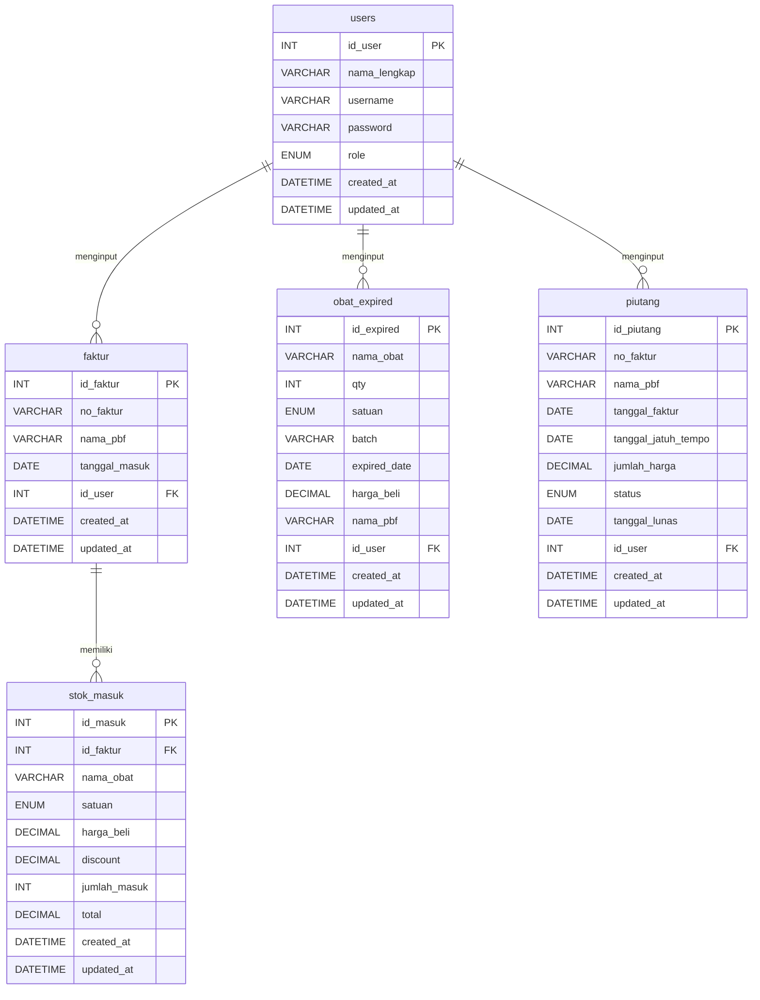
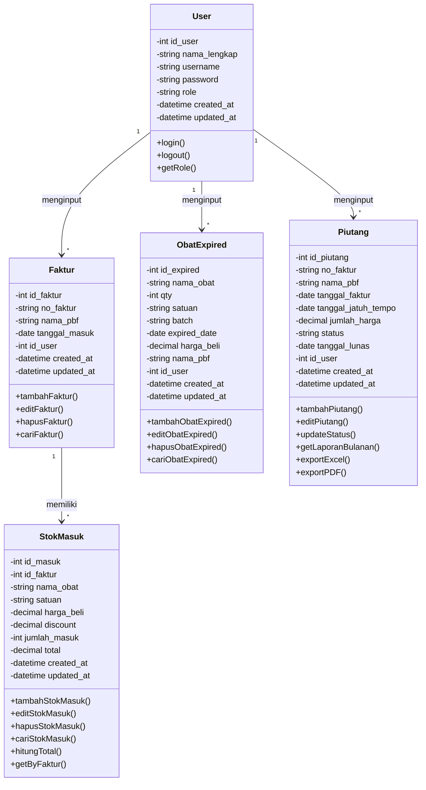

# PRODUCT REQUIREMENT DOCUMENT (PRD)

## Sistem Informasi Manajemen Stok Obat
## Apotek Ananda Jadimulya

**Versi:** 2.2 (Revisi)
**Tanggal:** 4 April 2026
**Disusun oleh:** Tim Pengembang

---

## Riwayat Perubahan

| Versi | Tanggal | Perubahan |
|-------|---------|-----------|
| 1.0 | - | Versi awal PRD |
| 2.0 | 4 April 2026 | Hapus fitur Kasir, Stok Keluar, Laporan Harian. Gabung Manajemen Obat ke Stok Masuk. Tambah fitur Piutang. |
| 2.1 | 4 April 2026 | Revisi struktur Stok Masuk jadi tabel per faktur/PBF (tambah kolom discount). Laporan Expired jadi input manual terpisah. Restructure database. |
| 2.2 | 4 April 2026 | Tambah tabel faktur sebagai header. Laporan Expired hanya Super Admin. Tambah fitur Global Search & navigasi per Faktur/PBF. |

---

## 1. Tujuan Aplikasi

Sistem Informasi Manajemen Stok Obat ini dikembangkan untuk membantu **Apotek Ananda Jadimulya** dalam mengelola persediaan obat secara lebih efektif dan efisien. Sistem ini bertujuan untuk menggantikan proses pencatatan manual menjadi sistem terkomputerisasi sehingga pengelolaan stok obat dapat dilakukan dengan lebih cepat, akurat, dan terstruktur.

Adapun tujuan dari pengembangan sistem ini adalah sebagai berikut:

1. Mempermudah pencatatan stok obat yang masuk dari PBF (Pedagang Besar Farmasi) per faktur.
2. Mempermudah pengelolaan dan pencarian data obat masuk di apotek.
3. Mempermudah pemantauan obat yang mendekati tanggal kedaluwarsa (expired date) melalui input manual.
4. Mempermudah pencatatan dan pemantauan piutang ke PBF/Faktur.
5. Mempermudah pembuatan laporan piutang secara otomatis dengan fitur export.
6. Meningkatkan efisiensi pengelolaan persediaan obat di Apotek Ananda Jadimulya.

---

## 2. Target User

Sistem ini merupakan **website internal apotek** yang hanya dapat digunakan oleh pengguna internal.

Terdapat dua jenis pengguna dalam sistem ini:

### 2.1 Super Admin (Apoteker)

Super Admin memiliki **akses penuh** terhadap seluruh fitur sistem.

**Hak akses Super Admin:**

| No | Hak Akses | Keterangan |
|----|-----------|------------|
| 1 | Mengakses Dashboard | Melihat ringkasan data apotek |
| 2 | Mengelola Faktur & Stok Masuk | Tambah faktur, input, edit, hapus obat per faktur |
| 3 | Global Search Obat | Mencari data obat dari seluruh PBF/faktur |
| 4 | Mengelola Laporan Obat Expired | Input, edit, hapus, dan lihat data obat expired |
| 5 | Mengelola Piutang | Input, edit, lihat, dan export data piutang |
| 6 | Mengelola Akun Admin | Tambah, edit, dan hapus akun admin |

---

### 2.2 Admin (Asisten Apoteker)

Admin bertugas membantu operasional apotek sehari-hari.

**Hak akses Admin:**

| No | Hak Akses | Keterangan |
|----|-----------|------------|
| 1 | Mengakses Dashboard | Melihat ringkasan data apotek |
| 2 | Mengelola Faktur & Stok Masuk | Tambah faktur, input, edit obat per faktur |
| 3 | Global Search Obat | Mencari data obat dari seluruh PBF/faktur |
| 4 | Melihat Laporan Obat Expired | Hanya melihat data obat expired |
| 5 | Mengelola Piutang | Input dan lihat data piutang |

> [!NOTE]
> Admin **tidak memiliki akses** untuk: (1) menghapus data stok masuk, (2) input/edit/hapus laporan obat expired, (3) mengelola akun admin. Fitur laporan expired (input, edit, hapus) dan manajemen akun hanya tersedia untuk Super Admin.

---

## 3. Alur Kerja Sistem

### 3.1 Input Stok Obat Masuk (Per Faktur / PBF)

Proses ini dilakukan ketika PBF mengirim obat ke apotek. Admin/Super Admin **membuat faktur terlebih dahulu**, kemudian menginput daftar obat di dalam faktur tersebut.

**Alur proses:**

```
Start
  │
  ▼
Admin/Super Admin login ke sistem
  │
  ▼
Membuka menu "Stok Masuk"
  │
  ▼
Sistem menampilkan daftar faktur/PBF
  │
  ▼
┌─────────────────────────────────────┐
│ Apakah faktur sudah ada?            │
├─────────┬───────────────────────────┤
│   YA    │          TIDAK            │
│         │                           │
│  ▼      │     ▼                     │
│ Klik    │  Klik "Tambah Faktur      │
│ faktur  │  Baru"                    │
│ yang    │  Isi data faktur:         │
│ ada     │  - No. Faktur             │
│         │  - Nama PBF               │
│         │  - Tanggal Masuk          │
│         │  Simpan faktur baru       │
└────┬────┴──────────┬────────────────┘
     │               │
     ▼               ▼
Masuk ke halaman detail faktur
  │
  ▼
Klik "+ Tambah Obat"
  │
  ▼
Isi data obat:
- Nama obat
- Satuan
- Harga beli
- Discount
- Jumlah masuk
  │
  ▼
Sistem menghitung total otomatis:
Total = (Harga Beli - Discount) × Jumlah Masuk
  │
  ▼
Klik Simpan
  │
  ▼
Data obat tampil di tabel faktur
(bisa tambah obat lagi di faktur yang sama)
  │
  ▼
End
```

---

### 3.2 Global Search Obat

Fitur pencarian yang memungkinkan user mencari obat tertentu dan menampilkan data obat tersebut dari **seluruh PBF/faktur**.

**Alur proses:**

```
Start
  │
  ▼
Login ke sistem
  │
  ▼
Ketik nama obat di kolom search global
(contoh: "Paracetamol")
  │
  ▼
Sistem menampilkan semua data obat
"Paracetamol" dari seluruh PBF/faktur
(lengkap dengan kolom: tanggal, satuan,
 harga beli, discount, jumlah, total,
 no. faktur, nama PBF)
  │
  ▼
User dapat melihat perbandingan
harga dari berbagai PBF
  │
  ▼
End
```

---

### 3.3 Input Laporan Obat Expired (Manual — Super Admin Only)

Fitur ini digunakan oleh **Super Admin** untuk **mencatat secara manual** obat-obat yang mendekati atau sudah melewati tanggal kedaluwarsa. Admin hanya dapat melihat data.

**Alur proses:**

```
Start
  │
  ▼
Login ke sistem
  │
  ▼
Membuka menu "Laporan Obat Expired"
  │
  ▼
Klik "Tambah Data Expired"
  │
  ▼
Isi data obat expired:
- Nama obat
- Qty (jumlah)
- Satuan
- Batch
- Expired date
- Harga beli
- Nama PBF
  │
  ▼
Klik Simpan
  │
  ▼
Sistem menyimpan data
  │
  ▼
Data ditampilkan di tabel laporan obat expired
  │
  ▼
End
```

---

### 3.4 Manajemen Piutang

Fitur ini digunakan untuk mencatat, memantau, dan merekap piutang apotek kepada PBF berdasarkan faktur pembelian.

**Alur proses input piutang:**

```
Start
  │
  ▼
Login ke sistem
  │
  ▼
Membuka menu "Piutang"
  │
  ▼
Klik "Tambah Piutang"
  │
  ▼
Isi data piutang:
- No. Faktur
- Nama PBF
- Tanggal Jatuh Tempo
- Jumlah Harga
- Status (Belum Lunas)
  │
  ▼
Sistem menyimpan data piutang
  │
  ▼
End
```

**Alur proses pelunasan piutang:**

```
Start
  │
  ▼
Login ke sistem
  │
  ▼
Membuka menu "Piutang"
  │
  ▼
Cari piutang yang akan dilunasi
  │
  ▼
Ubah status menjadi "Lunas"
  │
  ▼
Sistem otomatis mencatat tanggal pelunasan
  │
  ▼
End
```

**Alur proses export laporan piutang:**

```
Start
  │
  ▼
Login ke sistem
  │
  ▼
Membuka menu "Piutang"
  │
  ▼
Pilih filter bulan/periode
  │
  ▼
Sistem menampilkan rekap piutang per bulan
  │
  ▼
Klik "Export" (format Excel/PDF)
  │
  ▼
File laporan terunduh
  │
  ▼
End
```

---

## 4. Feature MVP

Berikut adalah fitur-fitur utama yang akan dikembangkan dalam sistem:

### 4.1 Login System

| Komponen | Deskripsi |
|----------|-----------|
| Login username | Input username untuk masuk ke sistem |
| Autentikasi user | Validasi kredensial pengguna |
| Pembagian role | Membedakan hak akses Super Admin dan Admin |
| Session management | Mengelola sesi login pengguna |

---

### 4.2 Dashboard

Dashboard menampilkan ringkasan informasi penting apotek:

| No | Informasi | Keterangan |
|----|-----------|------------|
| 1 | Total Stok Masuk | Jumlah total record stok obat masuk |
| 2 | Obat Hampir Expired | Jumlah obat yang mendekati kedaluwarsa |
| 3 | Total Piutang Belum Lunas | Jumlah piutang yang belum dilunasi |
| 4 | Total Piutang Bulan Ini | Rekap piutang bulan berjalan |

---

### 4.3 Stok Masuk (Per Faktur / PBF)

Fitur utama untuk mencatat obat yang masuk dari PBF. User **membuat faktur terlebih dahulu**, lalu menginput daftar obat di dalamnya.

**Navigasi Stok Masuk:**

```
Menu "Stok Masuk"
│
├── 🔍 [Search Global] ← cari obat dari semua PBF/faktur
│
├── 📋 Daftar Faktur/PBF
│   ├── Carmella (F-001) - 12 Maret 2026
│   │   ├── Paracetamol 500mg — 100 Strip
│   │   ├── Amoxicillin 250mg — 50 Box
│   │   └── [+ Tambah Obat]
│   │
│   ├── Kimia Farma (F-015) - 15 Maret 2026
│   │   ├── Omeprazole 20mg — 30 Strip
│   │   └── [+ Tambah Obat]
│   │
│   └── [+ Tambah Faktur Baru]
```

**Fitur Faktur:**

| No | Fitur | Akses |
|----|-------|-------|
| 1 | Tambah faktur baru | Super Admin, Admin |
| 2 | Edit data faktur | Super Admin, Admin |
| 3 | Hapus faktur (beserta semua obat di dalamnya) | Super Admin saja |
| 4 | Lihat daftar faktur | Super Admin, Admin |

**Input data faktur baru:**

| No | Kolom | Tipe | Keterangan |
|----|-------|------|------------|
| 1 | No. Faktur | Text | Nomor faktur dari PBF |
| 2 | Nama PBF | Text | Nama Pedagang Besar Farmasi |
| 3 | Tanggal Masuk | Date | Tanggal obat diterima |

**Fitur Obat (di dalam faktur):**

| No | Fitur | Akses |
|----|-------|-------|
| 1 | Tambah obat ke faktur | Super Admin, Admin |
| 2 | Edit data obat | Super Admin, Admin |
| 3 | Hapus data obat | Super Admin saja |
| 4 | Lihat daftar obat per faktur | Super Admin, Admin |

**Kolom tabel obat per faktur (input & tampilan):**

| No | Kolom | Tipe | Keterangan |
|----|-------|------|------------|
| 1 | Nomor | Auto | Nomor urut |
| 2 | Nama Obat | Text | Nama obat yang masuk |
| 3 | Satuan | Select | Satuan obat (Tube, Strip, Box, Pcs, dll) |
| 4 | Harga Beli | Number | Harga beli per satuan |
| 5 | Discount | Number | Potongan harga (dalam rupiah) |
| 6 | Jumlah Masuk | Number | Jumlah obat yang diterima |
| 7 | Total | Auto | Otomatis: (Harga Beli - Discount) × Jumlah Masuk |
| 8 | Aksi | Button | Edit, Hapus (Super Admin) |

---

### 4.4 Global Search Obat

Fitur pencarian lintas faktur/PBF. User bisa mencari nama obat dan melihat semua data obat tersebut dari seluruh PBF.

**Contoh:** Cari "Paracetamol" → tampil:

| Tanggal | Nama Obat | Satuan | Harga Beli | Discount | Jumlah | Total | No. Faktur | PBF |
|---------|-----------|--------|------------|----------|--------|-------|------------|-----|
| 01/03/2026 | Paracetamol 500mg | Strip | 5.000 | 0 | 100 | 500.000 | F-001 | Carmella |
| 15/03/2026 | Paracetamol 500mg | Strip | 4.800 | 200 | 50 | 230.000 | F-015 | Kimia Farma |

**Opsi satuan obat:**

| No | Satuan |
|----|--------|
| 1 | Tube |
| 2 | FLS (Fles/Botol) |
| 3 | Strip |
| 4 | Sach (Sachet) |
| 5 | Box |
| 6 | Kaleng |
| 7 | Pcs |
| 8 | Tablet |
| 9 | Kapsul |
| 10 | Ampul |
| 11 | Supp (Suppositoria) |
| 12 | Ovula |
| 13 | Pack |

---

### 4.5 Laporan Obat Expired (Input Manual — Super Admin Only)

Fitur ini digunakan oleh **Super Admin** untuk **mencatat secara manual** data obat yang mendekati atau sudah melewati tanggal kedaluwarsa. **Admin hanya dapat melihat** data.

**Fitur:**

| No | Fitur | Akses |
|----|-------|-------|
| 1 | Melihat tabel data obat expired | Super Admin, Admin |
| 2 | Tambah data obat expired (input manual) | **Super Admin saja** |
| 3 | Edit data obat expired | **Super Admin saja** |
| 4 | Hapus data obat expired | **Super Admin saja** |
| 5 | Search/cari data | Super Admin, Admin |

**Kolom tabel obat expired (input & tampilan):**

| No | Kolom | Tipe | Keterangan |
|----|-------|------|------------|
| 1 | Nomor | Auto | Nomor urut |
| 2 | Nama Obat | Text | Nama obat yang expired |
| 3 | Qty | Number | Jumlah stok obat yang expired |
| 4 | Satuan | Select | Satuan obat |
| 5 | Batch | Text | Nomor batch produksi |
| 6 | Expired Date | Date | Tanggal kedaluwarsa |
| 7 | Harga Beli | Number | Harga beli per satuan |
| 8 | Nama PBF | Text | Nama Pedagang Besar Farmasi |
| 9 | Aksi | Button | Edit, Hapus (Super Admin) |

---

### 4.6 Piutang (Accounts Receivable)

Fitur untuk mencatat dan merekap piutang apotek kepada PBF berdasarkan faktur pembelian.

**Data input piutang:**

| No | Kolom | Tipe Input | Keterangan |
|----|-------|------------|------------|
| 1 | No. Faktur | Text | Nomor faktur pembelian dari PBF |
| 2 | Nama PBF | Text | Nama Pedagang Besar Farmasi |
| 3 | Tanggal Jatuh Tempo | Date | Batas waktu pelunasan |
| 4 | Jumlah Harga | Number | Total nilai faktur |
| 5 | Status | Select | "Lunas" atau "Belum Lunas" |
| 6 | Tanggal Lunas | Date | Otomatis terisi saat status diubah ke "Lunas" |

**Output laporan piutang per bulan:**

| No | Kolom | Keterangan |
|----|-------|------------|
| 1 | Nomor | Nomor urut |
| 2 | No. Faktur | Nomor faktur |
| 3 | Nama PBF | Nama PBF |
| 4 | Tanggal Jatuh Tempo | Batas waktu pembayaran |
| 5 | Jumlah Harga | Total nilai faktur |
| 6 | Status | Lunas / Belum Lunas |
| 7 | Tanggal Lunas | Tanggal pelunasan (jika sudah lunas) |

**Fitur tambahan piutang:**

| No | Fitur | Keterangan |
|----|-------|------------|
| 1 | Filter per bulan | Menampilkan data piutang berdasarkan bulan |
| 2 | Filter per status | Filter berdasarkan Lunas / Belum Lunas |
| 3 | Export Excel | Mengunduh laporan piutang dalam format Excel |
| 4 | Export PDF | Mengunduh laporan piutang dalam format PDF |
| 5 | Ringkasan total | Total piutang lunas dan belum lunas per bulan |

---

### 4.7 Manajemen Admin

Fitur ini **hanya dapat diakses oleh Super Admin**.

| No | Fitur | Keterangan |
|----|-------|------------|
| 1 | Tambah Admin | Menambah akun admin baru |
| 2 | Edit Admin | Mengubah data akun admin |
| 3 | Hapus Admin | Menghapus akun admin |
| 4 | Lihat Daftar Admin | Menampilkan semua akun admin |

---

## 5. Struktur Database

Database menggunakan **5 tabel utama:**

| No | Nama Tabel | Keterangan |
|----|------------|------------|
| 1 | `users` | Data pengguna sistem |
| 2 | `faktur` | Data faktur/invoice dari PBF (header) |
| 3 | `stok_masuk` | Detail obat per faktur (detail item) |
| 4 | `obat_expired` | Data obat expired (input manual) |
| 5 | `piutang` | Data piutang ke PBF |

---

## 6. Struktur Tabel Database

### 6.1 Tabel `users`

| Field | Tipe Data | Keterangan |
|-------|-----------|------------|
| `id_user` | INT (PK, AI) | ID user |
| `nama_lengkap` | VARCHAR(100) | Nama lengkap user |
| `username` | VARCHAR(50) UNIQUE | Username untuk login |
| `password` | VARCHAR(255) | Password (hashed) |
| `role` | ENUM('super_admin', 'admin') | Hak akses pengguna |
| `created_at` | DATETIME | Tanggal akun dibuat |
| `updated_at` | DATETIME | Tanggal terakhir diperbarui |

---

### 6.2 Tabel `faktur`

| Field | Tipe Data | Keterangan |
|-------|-----------|------------|
| `id_faktur` | INT (PK, AI) | ID faktur |
| `no_faktur` | VARCHAR(100) | Nomor faktur dari PBF |
| `nama_pbf` | VARCHAR(100) | Nama Pedagang Besar Farmasi |
| `tanggal_masuk` | DATE | Tanggal obat diterima |
| `id_user` | INT (FK → users.id_user) | User yang menginput |
| `created_at` | DATETIME | Tanggal data dibuat |
| `updated_at` | DATETIME | Tanggal terakhir diperbarui |

---

### 6.3 Tabel `stok_masuk`

| Field | Tipe Data | Keterangan |
|-------|-----------|------------|
| `id_masuk` | INT (PK, AI) | ID stok masuk |
| `id_faktur` | INT (FK → faktur.id_faktur) | Relasi ke faktur |
| `nama_obat` | VARCHAR(100) | Nama obat yang masuk |
| `satuan` | ENUM('Tube', 'FLS', 'Strip', 'Sach', 'Box', 'Kaleng', 'Pcs', 'Tablet', 'Kapsul', 'Ampul', 'Supp', 'Ovula', 'Pack') | Satuan obat |
| `harga_beli` | DECIMAL(12,2) | Harga beli per satuan |
| `discount` | DECIMAL(12,2) DEFAULT 0 | Potongan harga |
| `jumlah_masuk` | INT | Jumlah obat yang masuk |
| `total` | DECIMAL(12,2) | Total: (harga_beli - discount) × jumlah_masuk |
| `created_at` | DATETIME | Tanggal data dibuat |
| `updated_at` | DATETIME | Tanggal terakhir diperbarui |

---

### 6.4 Tabel `obat_expired`

| Field | Tipe Data | Keterangan |
|-------|-----------|------------|
| `id_expired` | INT (PK, AI) | ID data expired |
| `nama_obat` | VARCHAR(100) | Nama obat |
| `qty` | INT | Jumlah obat yang expired |
| `satuan` | ENUM('Tube', 'FLS', 'Strip', 'Sach', 'Box', 'Kaleng', 'Pcs', 'Tablet', 'Kapsul', 'Ampul', 'Supp', 'Ovula', 'Pack') | Satuan obat |
| `batch` | VARCHAR(50) | Nomor batch produksi |
| `expired_date` | DATE | Tanggal kedaluwarsa |
| `harga_beli` | DECIMAL(12,2) | Harga beli per satuan |
| `nama_pbf` | VARCHAR(100) | Nama Pedagang Besar Farmasi |
| `id_user` | INT (FK → users.id_user) | User yang menginput |
| `created_at` | DATETIME | Tanggal data dibuat |
| `updated_at` | DATETIME | Tanggal terakhir diperbarui |

---

### 6.5 Tabel `piutang`

| Field | Tipe Data | Keterangan |
|-------|-----------|------------|
| `id_piutang` | INT (PK, AI) | ID piutang |
| `no_faktur` | VARCHAR(100) | Nomor faktur pembelian |
| `nama_pbf` | VARCHAR(100) | Nama Pedagang Besar Farmasi |
| `tanggal_faktur` | DATE | Tanggal faktur diterbitkan |
| `tanggal_jatuh_tempo` | DATE | Tanggal batas pembayaran |
| `jumlah_harga` | DECIMAL(12,2) | Total nilai faktur |
| `status` | ENUM('lunas', 'belum_lunas') DEFAULT 'belum_lunas' | Status pembayaran |
| `tanggal_lunas` | DATE NULL | Tanggal pelunasan (NULL jika belum lunas) |
| `id_user` | INT (FK → users.id_user) | User yang menginput |
| `created_at` | DATETIME | Tanggal data dibuat |
| `updated_at` | DATETIME | Tanggal terakhir diperbarui |

---

## 7. ERD (Entity Relationship Diagram)



**Relasi Antar Tabel:**

```
users
  │
  │ 1 ──── * (one-to-many)
  │
  ├──────── faktur         (user menginput faktur)
  │
  ├──────── obat_expired   (user menginput data obat expired)
  │
  └──────── piutang        (user menginput piutang)


faktur
  │
  │ 1 ──── * (one-to-many)
  │
  └──────── stok_masuk     (faktur memiliki banyak item obat)
```

> [!NOTE]
> Tabel `faktur` berfungsi sebagai **header** yang menyimpan info faktur/PBF, sedangkan `stok_masuk` menyimpan **detail item obat** per faktur. Tabel `obat_expired` bersifat independen (input manual oleh Super Admin).

---

## 8. Use Case Diagram

### Aktor:
- **Super Admin** (Apoteker)
- **Admin** (Asisten Apoteker)

```
┌─────────────────────────────────────────────────────────────┐
│                      SISTEM APOTEK                          │
│                                                             │
│   ┌───────────────────┐                                     │
│   │  Login             │◄──────── Super Admin & Admin       │
│   └───────────────────┘                                     │
│                                                             │
│   ┌───────────────────┐                                     │
│   │  Dashboard         │◄──────── Super Admin & Admin       │
│   └───────────────────┘                                     │
│                                                             │
│   ┌───────────────────┐                                     │
│   │  Stok Masuk        │◄──────── Super Admin & Admin       │
│   │  (Per Faktur/PBF)  │          (Hapus: Super Admin)      │
│   └───────────────────┘                                     │
│                                                             │
│   ┌───────────────────┐                                     │
│   │  Laporan Obat      │◄──────── Super Admin & Admin       │
│   │  Expired (Manual)  │          (Hapus: Super Admin)      │
│   └───────────────────┘                                     │
│                                                             │
│   ┌───────────────────┐                                     │
│   │  Piutang           │◄──────── Super Admin & Admin       │
│   └───────────────────┘                                     │
│                                                             │
│   ┌───────────────────┐                                     │
│   │  Kelola Admin      │◄──────── Super Admin SAJA          │
│   └───────────────────┘                                     │
│                                                             │
│   ┌───────────────────┐                                     │
│   │  Logout            │◄──────── Super Admin & Admin       │
│   └───────────────────┘                                     │
│                                                             │
└─────────────────────────────────────────────────────────────┘
```

**Detail Use Case per Aktor:**

```
Super Admin (Apoteker)
    │
    ├─── Login
    ├─── Dashboard
    ├─── Stok Masuk per Faktur/PBF (Tambah, Edit, Hapus, Lihat, Cari)
    ├─── Laporan Obat Expired (Tambah, Edit, Hapus, Lihat, Cari)
    ├─── Kelola Piutang (Tambah, Edit, Lihat, Export)
    ├─── Kelola Admin (Tambah, Edit, Hapus)
    └─── Logout

Admin (Asisten Apoteker)
    │
    ├─── Login
    ├─── Dashboard
    ├─── Stok Masuk per Faktur/PBF (Tambah, Edit, Lihat, Cari)
    ├─── Laporan Obat Expired (Tambah, Lihat, Cari)
    ├─── Kelola Piutang (Tambah, Lihat)
    └─── Logout
```

---

## 9. Activity Diagram

### 9.1 Activity Diagram — Input Stok Masuk

```
┌───────┐
│ Start │
└───┬───┘
    ▼
┌──────────────────────┐
│ Login Admin/Super    │
│ Admin                │
└───┬──────────────────┘
    ▼
┌──────────────────────┐
│ Buka Menu            │
│ "Stok Masuk"         │
└───┬──────────────────┘
    ▼
┌──────────────────────┐
│ Sistem Menampilkan   │
│ Tabel Stok Masuk     │
│ (per Faktur/PBF)     │
└───┬──────────────────┘
    ▼
┌──────────────────────┐
│ Klik "Tambah         │
│ Stok Masuk"          │
└───┬──────────────────┘
    ▼
┌──────────────────────┐
│ Input Data:          │
│ - Tanggal masuk      │
│ - Nama obat          │
│ - Satuan             │
│ - Harga beli         │
│ - Discount           │
│ - Jumlah masuk       │
└───┬──────────────────┘
    ▼
┌──────────────────────┐
│ Sistem Hitung Total: │
│ (Harga Beli -        │
│  Discount) ×         │
│  Jumlah Masuk        │
└───┬──────────────────┘
    ▼
┌──────────────────────┐
│ Klik Simpan          │
└───┬──────────────────┘
    ▼
┌──────────────────────┐
│ Sistem Menyimpan     │
│ Data Stok Masuk      │
└───┬──────────────────┘
    ▼
┌──────────────────────┐
│ Data Tampil di       │
│ Tabel per Faktur/PBF │
└───┬──────────────────┘
    ▼
┌───────┐
│  End  │
└───────┘
```

---

### 9.2 Activity Diagram — Input Obat Expired (Manual)

```
┌───────┐
│ Start │
└───┬───┘
    ▼
┌──────────────────────┐
│ Login Admin/Super    │
│ Admin                │
└───┬──────────────────┘
    ▼
┌──────────────────────┐
│ Buka Menu "Laporan   │
│ Obat Expired"        │
└───┬──────────────────┘
    ▼
┌──────────────────────┐
│ Sistem Menampilkan   │
│ Tabel Obat Expired   │
└───┬──────────────────┘
    ▼
┌──────────────────────┐
│ Klik "Tambah Data    │
│ Expired"             │
└───┬──────────────────┘
    ▼
┌──────────────────────┐
│ Input Data:          │
│ - Nama obat          │
│ - Qty                │
│ - Satuan             │
│ - Batch              │
│ - Expired date       │
│ - Harga beli         │
│ - Nama PBF           │
└───┬──────────────────┘
    ▼
┌──────────────────────┐
│ Klik Simpan          │
└───┬──────────────────┘
    ▼
┌──────────────────────┐
│ Sistem Menyimpan     │
│ Data Obat Expired    │
└───┬──────────────────┘
    ▼
┌──────────────────────┐
│ Data Tampil di       │
│ Tabel Obat Expired   │
└───┬──────────────────┘
    ▼
┌───────┐
│  End  │
└───────┘
```

---

### 9.3 Activity Diagram — Manajemen Piutang

```
┌───────┐
│ Start │
└───┬───┘
    ▼
┌──────────────────────┐
│ Login ke Sistem      │
└───┬──────────────────┘
    ▼
┌──────────────────────┐
│ Buka Menu "Piutang"  │
└───┬──────────────────┘
    ▼
┌─────────────────────────────────┐
│    Pilih Aksi                   │
├──────┬──────────┬───────────────┤
│Input │ Lunasi   │ Export        │
│Baru  │ Piutang  │ Laporan      │
└──┬───┴────┬─────┴──────┬───────┘
   ▼        ▼            ▼
┌────────┐┌──────────┐┌───────────┐
│Isi Data││Cari      ││Pilih      │
│Piutang:││Piutang   ││Bulan/     │
│-No.Fak.││yang akan ││Periode    │
│-PBF    ││dilunasi  │└─────┬─────┘
│-Jt.Tmp.│└────┬─────┘      ▼
│-Jumlah │     ▼       ┌───────────┐
│-Status │┌──────────┐ │Sistem     │
└───┬────┘│Ubah      │ │Tampilkan  │
    ▼     │Status ke │ │Rekap      │
┌────────┐│"Lunas"   │ │Piutang    │
│Simpan  │└────┬─────┘ └─────┬─────┘
│Data    │     ▼            ▼
└───┬────┘┌──────────┐┌───────────┐
    ▼     │Tanggal   ││Klik       │
┌────────┐│Lunas     ││Export     │
│Selesai ││Otomatis  ││(Excel/PDF)│
└────────┘│Tercatat  │└─────┬─────┘
          └────┬─────┘      ▼
               ▼       ┌───────────┐
          ┌────────┐   │File       │
          │Selesai │   │Terunduh   │
          └────────┘   └─────┬─────┘
                             ▼
                        ┌────────┐
                        │Selesai │
                        └────────┘
```

---

## 10. Class Diagram



---

## 11. Struktur Direktori Proyek

```
apotek-ananda/
│
├── backend/
│   │
│   ├── config/
│   │   └── database.php              # Konfigurasi koneksi database
│   │
│   ├── controllers/
│   │   ├── auth_controller.php        # Proses login & logout
│   │   ├── stok_masuk_controller.php  # CRUD data stok masuk
│   │   ├── expired_controller.php     # CRUD data obat expired
│   │   ├── piutang_controller.php     # CRUD piutang & export
│   │   └── admin_controller.php       # CRUD akun admin
│   │
│   ├── models/
│   │   ├── user.php                   # Model tabel users
│   │   ├── stok_masuk.php             # Model tabel stok_masuk
│   │   ├── obat_expired.php           # Model tabel obat_expired
│   │   └── piutang.php                # Model tabel piutang
│   │
│   └── helpers/
│       ├── session_helper.php         # Helper session management
│       └── export_helper.php          # Helper export Excel & PDF
│
├── frontend/
│   │
│   ├── assets/
│   │   ├── css/
│   │   │   └── style.css              # Stylesheet utama
│   │   ├── js/
│   │   │   └── script.js              # JavaScript utama
│   │   └── images/                    # Folder gambar/logo
│   │
│   ├── templates/
│   │   ├── header.php                 # Template header
│   │   ├── sidebar.php                # Template sidebar navigasi
│   │   └── footer.php                 # Template footer
│   │
│   ├── auth/
│   │   └── login.php                  # Halaman login
│   │
│   ├── superadmin/
│   │   ├── dashboard.php              # Dashboard Super Admin
│   │   ├── stok_masuk.php             # Halaman stok masuk per faktur/PBF
│   │   ├── laporan_expired.php        # Halaman input & laporan obat expired
│   │   ├── piutang.php                # Halaman manajemen piutang
│   │   └── kelola_admin.php           # Halaman kelola admin
│   │
│   └── admin/
│       ├── dashboard.php              # Dashboard Admin
│       ├── stok_masuk.php             # Halaman stok masuk per faktur/PBF
│       ├── laporan_expired.php        # Halaman input & lihat obat expired
│       └── piutang.php                # Halaman piutang (lihat & input)
│
├── exports/                           # Folder output file export
│   └── .gitkeep
│
├── index.php                          # Entry point → redirect ke login
└── logout.php                         # Proses logout
```

---

### Penjelasan Struktur Direktori

#### 1. Folder `backend/`

Mengelola logika sistem dan koneksi database.

| Subfolder | File | Keterangan |
|-----------|------|------------|
| `config/` | `database.php` | Konfigurasi koneksi ke database MySQL |
| `controllers/` | `auth_controller.php` | Proses login, validasi, dan logout |
| | `stok_masuk_controller.php` | CRUD data stok masuk per faktur/PBF |
| | `expired_controller.php` | CRUD data obat expired (input manual) |
| | `piutang_controller.php` | CRUD piutang, update status, dan export laporan |
| | `admin_controller.php` | CRUD akun admin (Super Admin only) |
| `models/` | `user.php` | Query tabel `users` |
| | `stok_masuk.php` | Query tabel `stok_masuk` |
| | `obat_expired.php` | Query tabel `obat_expired` |
| | `piutang.php` | Query tabel `piutang` |
| `helpers/` | `session_helper.php` | Fungsi bantu session & autentikasi |
| | `export_helper.php` | Fungsi bantu export ke Excel & PDF |

---

#### 2. Folder `frontend/`

Berisi halaman yang dilihat oleh pengguna.

| Subfolder | File | Keterangan |
|-----------|------|------------|
| `assets/css/` | `style.css` | Stylesheet utama |
| `assets/js/` | `script.js` | JavaScript untuk interaksi UI |
| `assets/images/` | – | Logo dan gambar pendukung |
| `templates/` | `header.php` | Header (navbar, info user) |
| | `sidebar.php` | Sidebar navigasi (dinamis per role) |
| | `footer.php` | Footer |
| `auth/` | `login.php` | Halaman login |
| `superadmin/` | 5 file | Semua halaman Super Admin |
| `admin/` | 4 file | Halaman Admin (tanpa kelola_admin) |

---

#### 3. Folder `exports/`

Folder untuk menyimpan file hasil export laporan piutang (Excel/PDF).

---

#### 4. File Utama

| File | Keterangan |
|------|------------|
| `index.php` | Entry point, mengarahkan pengguna ke halaman login |
| `logout.php` | Proses logout dan destroy session |

---

## 12. SQL Database Schema

```sql
-- =============================================
-- DATABASE: apotek_ananda
-- =============================================

CREATE DATABASE IF NOT EXISTS apotek_ananda;
USE apotek_ananda;

-- =============================================
-- TABEL: users
-- =============================================
CREATE TABLE users (
    id_user INT AUTO_INCREMENT PRIMARY KEY,
    nama_lengkap VARCHAR(100) NOT NULL,
    username VARCHAR(50) NOT NULL UNIQUE,
    password VARCHAR(255) NOT NULL,
    role ENUM('super_admin', 'admin') NOT NULL DEFAULT 'admin',
    created_at DATETIME DEFAULT CURRENT_TIMESTAMP,
    updated_at DATETIME DEFAULT CURRENT_TIMESTAMP ON UPDATE CURRENT_TIMESTAMP
);

-- Insert default Super Admin
INSERT INTO users (nama_lengkap, username, password, role)
VALUES ('Apoteker', 'superadmin', '$2y$10$hashed_password_here', 'super_admin');

-- =============================================
-- TABEL: faktur
-- =============================================
CREATE TABLE faktur (
    id_faktur INT AUTO_INCREMENT PRIMARY KEY,
    no_faktur VARCHAR(100) NOT NULL,
    nama_pbf VARCHAR(100) NOT NULL,
    tanggal_masuk DATE NOT NULL,
    id_user INT NOT NULL,
    created_at DATETIME DEFAULT CURRENT_TIMESTAMP,
    updated_at DATETIME DEFAULT CURRENT_TIMESTAMP ON UPDATE CURRENT_TIMESTAMP,
    FOREIGN KEY (id_user) REFERENCES users(id_user) ON DELETE CASCADE
);

-- =============================================
-- TABEL: stok_masuk
-- =============================================
CREATE TABLE stok_masuk (
    id_masuk INT AUTO_INCREMENT PRIMARY KEY,
    id_faktur INT NOT NULL,
    nama_obat VARCHAR(100) NOT NULL,
    satuan ENUM('Tube', 'FLS', 'Strip', 'Sach', 'Box', 'Kaleng', 'Pcs', 'Tablet', 'Kapsul', 'Ampul', 'Supp', 'Ovula', 'Pack') NOT NULL,
    harga_beli DECIMAL(12,2) NOT NULL DEFAULT 0,
    discount DECIMAL(12,2) NOT NULL DEFAULT 0,
    jumlah_masuk INT NOT NULL DEFAULT 0,
    total DECIMAL(12,2) NOT NULL DEFAULT 0,
    created_at DATETIME DEFAULT CURRENT_TIMESTAMP,
    updated_at DATETIME DEFAULT CURRENT_TIMESTAMP ON UPDATE CURRENT_TIMESTAMP,
    FOREIGN KEY (id_faktur) REFERENCES faktur(id_faktur) ON DELETE CASCADE
);

-- =============================================
-- TABEL: obat_expired
-- =============================================
CREATE TABLE obat_expired (
    id_expired INT AUTO_INCREMENT PRIMARY KEY,
    nama_obat VARCHAR(100) NOT NULL,
    qty INT NOT NULL DEFAULT 0,
    satuan ENUM('Tube', 'FLS', 'Strip', 'Sach', 'Box', 'Kaleng', 'Pcs', 'Tablet', 'Kapsul', 'Ampul', 'Supp', 'Ovula', 'Pack') NOT NULL,
    batch VARCHAR(50),
    expired_date DATE NOT NULL,
    harga_beli DECIMAL(12,2) NOT NULL DEFAULT 0,
    nama_pbf VARCHAR(100),
    id_user INT NOT NULL,
    created_at DATETIME DEFAULT CURRENT_TIMESTAMP,
    updated_at DATETIME DEFAULT CURRENT_TIMESTAMP ON UPDATE CURRENT_TIMESTAMP,
    FOREIGN KEY (id_user) REFERENCES users(id_user) ON DELETE CASCADE
);

-- =============================================
-- TABEL: piutang
-- =============================================
CREATE TABLE piutang (
    id_piutang INT AUTO_INCREMENT PRIMARY KEY,
    no_faktur VARCHAR(100) NOT NULL,
    nama_pbf VARCHAR(100) NOT NULL,
    tanggal_faktur DATE NOT NULL,
    tanggal_jatuh_tempo DATE NOT NULL,
    jumlah_harga DECIMAL(12,2) NOT NULL,
    status ENUM('lunas', 'belum_lunas') NOT NULL DEFAULT 'belum_lunas',
    tanggal_lunas DATE NULL,
    id_user INT NOT NULL,
    created_at DATETIME DEFAULT CURRENT_TIMESTAMP,
    updated_at DATETIME DEFAULT CURRENT_TIMESTAMP ON UPDATE CURRENT_TIMESTAMP,
    FOREIGN KEY (id_user) REFERENCES users(id_user) ON DELETE CASCADE
);

-- =============================================
-- INDEX untuk performa query
-- =============================================
CREATE INDEX idx_faktur_no ON faktur(no_faktur);
CREATE INDEX idx_faktur_pbf ON faktur(nama_pbf);
CREATE INDEX idx_faktur_tanggal ON faktur(tanggal_masuk);
CREATE INDEX idx_stok_masuk_obat ON stok_masuk(nama_obat);
CREATE INDEX idx_expired_date ON obat_expired(expired_date);
CREATE INDEX idx_expired_obat ON obat_expired(nama_obat);
CREATE INDEX idx_piutang_status ON piutang(status);
CREATE INDEX idx_piutang_jatuh_tempo ON piutang(tanggal_jatuh_tempo);
CREATE INDEX idx_piutang_faktur ON piutang(no_faktur);
```

---

## 13. Teknologi yang Digunakan

| Komponen | Teknologi |
|----------|-----------|
| Frontend | HTML, CSS, JavaScript |
| Backend | PHP (Native) |
| Database | MySQL |
| Server | Apache (XAMPP/Laragon) |
| Export | PhpSpreadsheet (Excel), TCPDF/DomPDF (PDF) |
| Hashing | PHP `password_hash()` / bcrypt |

---

## 14. Non-Functional Requirements

| No | Aspek | Kebutuhan |
|----|-------|-----------|
| 1 | **Keamanan** | Password di-hash menggunakan bcrypt. Session management untuk autentikasi. |
| 2 | **Responsif** | Tampilan responsif untuk desktop dan tablet. |
| 3 | **Kompatibilitas** | Mendukung browser Chrome, Firefox, dan Edge versi terbaru. |
| 4 | **Performa** | Halaman dimuat dalam waktu < 3 detik. |
| 5 | **Backup** | Database dapat di-backup melalui phpMyAdmin atau mysqldump. |

---

## 15. Ringkasan Perubahan dari Versi Sebelumnya

### Dari Versi 1.0 → 2.0

| No | Perubahan | Keterangan |
|----|-----------|------------|
| 1 | ❌ **Hapus** Sistem Kasir | Fitur POS/kasir dihapus sepenuhnya |
| 2 | ❌ **Hapus** Laporan Stok Keluar | Fitur stock opname 3 bulan dihapus |
| 3 | ✅ **Tambah** Fitur Piutang | Fitur baru untuk tracking piutang ke PBF |
| 4 | ❌ **Hapus** Tabel `penjualan` | Tidak diperlukan (kasir dihapus) |
| 5 | ❌ **Hapus** Tabel `detail_penjualan` | Tidak diperlukan (kasir dihapus) |
| 6 | ❌ **Hapus** Tabel `stok_keluar` | Tidak diperlukan (stok keluar dihapus) |

### Dari Versi 2.0 → 2.1

| No | Perubahan | Keterangan |
|----|-----------|------------|
| 1 | 🔄 **Revisi** Stok Masuk | Stok masuk jadi tabel sederhana per faktur/PBF. Kolom: tanggal, nama obat, satuan, harga beli, **discount**, jumlah, total |
| 2 | ❌ **Hapus** Tabel `obat` | Tabel master obat dihapus. Data obat langsung di tabel stok_masuk |
| 3 | ✅ **Tambah** Kolom `discount` | Kolom discount ditambahkan di stok_masuk |
| 4 | ✅ **Tambah** Kolom `no_faktur` & `nama_pbf` | Ditambahkan di stok_masuk untuk grouping per faktur/PBF |
| 5 | 🔄 **Revisi** Laporan Expired | Berubah dari otomatis (query tabel obat) menjadi **input manual** di tabel `obat_expired` |
| 6 | ✅ **Tambah** Tabel `obat_expired` | Tabel baru untuk input manual obat expired |
| 7 | 🔄 **Revisi** Direktori | Hapus `data_obat.php`, `obat_controller.php`, `obat.php`. Tambah `expired_controller.php`, `obat_expired.php` |

### Dari Versi 2.1 → 2.2

| No | Perubahan | Keterangan |
|----|-----------|------------|
| 1 | ✅ **Tambah** Fitur Faktur Header | Tambah konsep tabel faktur. Saat input obat, user harus buat/pilih faktur terlebih dahulu |
| 2 | ✅ **Tambah** Global Search | Fitur cari obat dari seluruh faktur/pbf dan lihat daftar harga serta sumbernya |
| 3 | 🔄 **Revisi** Hak Akses | Mengubah input Laporan Expired hanya bisa diakses oleh Super Admin |
| 4 | ✅ **Tambah** Tabel `faktur` | Tabel baru untuk parent dari list stok masuk. |
